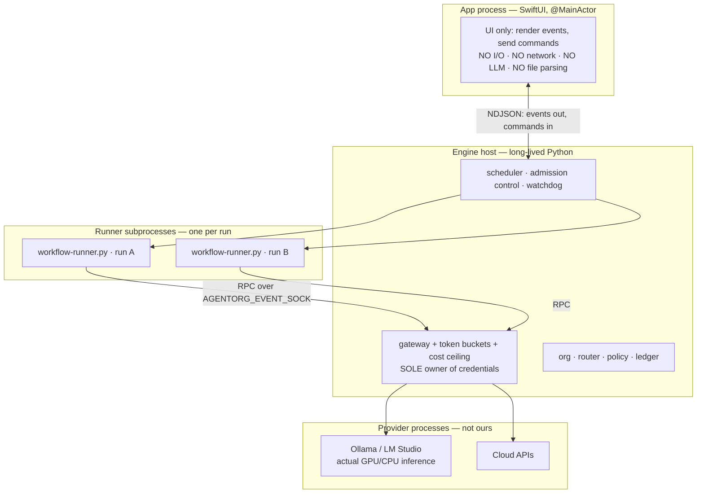
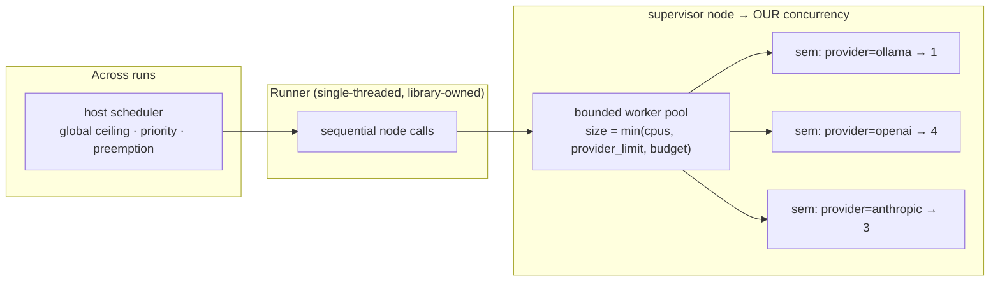
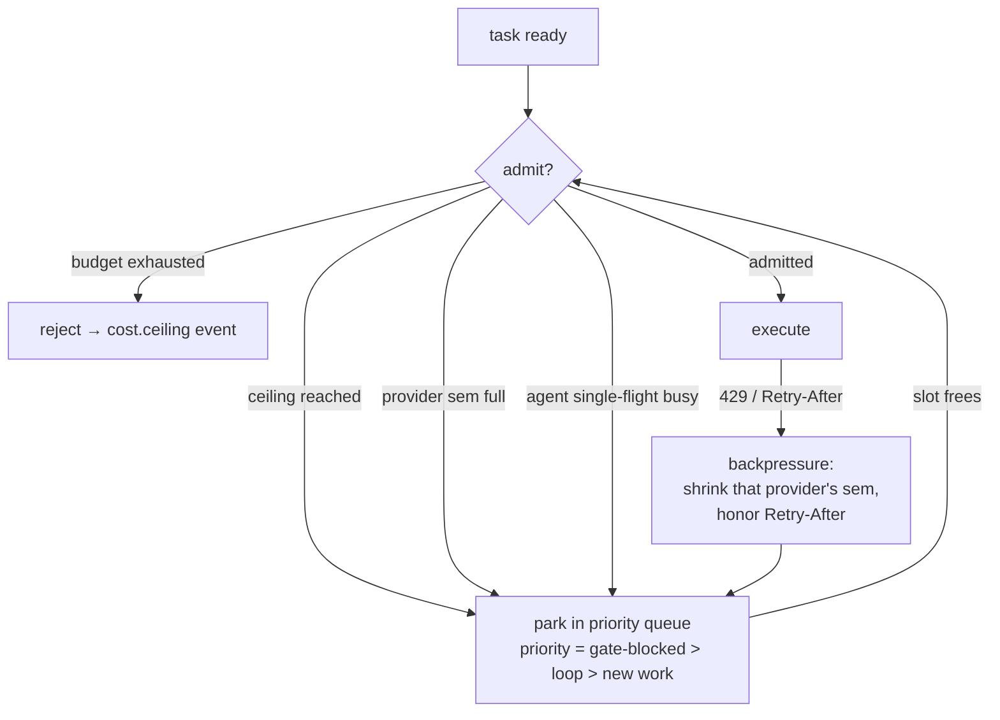
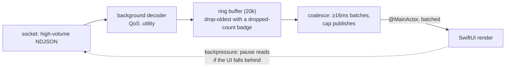

# AgentOrg — Design: Concurrency & Resource Governance

How many agents work at once, how they use macOS resources efficiently, and why
the app cannot hang.

## 1. The headline: the app cannot hang, by construction

Not by discipline — by architecture. **No agent work ever runs in the app
process.**



| Risk | Why it cannot happen |
|---|---|
| UI freeze from agent work | Agent work is in another process; the main thread only decodes events and renders |
| App crash from a runaway graph | The runner is a separate process the watchdog can SIGKILL; the app survives |
| UI storm from log volume | Events cross one socket; Swift coalesces and ring-buffers before touching the main thread |
| Secret exposure in workers | Runner subprocesses are **credential-free**; only the host holds keys |

**Where the CPU actually goes:** LLM inference happens in Ollama/LM Studio/cloud,
*not* in our engine. Our engine is **I/O-bound** (JSON, sockets, files), which is
why Python threads rather than asyncio are correct — the GIL is released during
I/O. "Efficient use of system resources" therefore means **concurrency control
and backpressure**, not CPU pinning.

## 2. Where real parallelism comes from



The library's runner is single-threaded by design; its `parallel:` blocks give
*join semantics*. Real parallelism therefore lives in **supervisor nodes**, whose
fan-out we implement in `executor.py`.

Three tiers, each bounded:

1. **Supervisor nodes** — genuine concurrency inside one `execute_node` call.
2. **Per-provider semaphores** — never exceed a provider's real limit.
3. **Host scheduler** — how many runs execute at once, under global ceilings.

## 3. Admission control and backpressure



Every queue has a max depth; when full the scheduler **sheds** lowest-priority
work with an explicit event rather than growing memory. The provider semaphore
**shrinks adaptively** on 429s and recovers slowly, so a rate-limited provider
throttles the org instead of failing it.

## 4. macOS-specific resource governance

On Apple Silicon, GPU memory is **unified memory**. Loading three local models at
once does not just slow the app — it causes system-wide swap and makes the whole
Mac sluggish.

| Control | Mechanism | Why |
|---|---|---|
| **Cap local model concurrency** | `sem: ollama → 1` by default (configurable) | Prevents VRAM thrash + swap; the most important setting on a laptop |
| **Respect the provider's limit** | align with `OLLAMA_NUM_PARALLEL` | Do not fight the provider's queue |
| **Unload idle models** | `keep_alive` tuning after idle | Frees unified memory when the org goes quiet |
| **QoS classes** | `.utility` for event decoding, `.userInitiated` for command acks | UI stays responsive under load |
| **Engine process priority** | lower scheduling priority during long fan-outs | Foreground apps stay snappy |
| **Memory ceiling** | `RLIMIT_AS` + RSS watchdog on the host | A leak kills the engine, not the Mac |
| **Thermal / low-power awareness** | `ProcessInfo.thermalState`, `isLowPowerModeEnabled` → shrink the ceiling | Degrade gracefully on battery |
| **App Nap** | declare long-running activity during a run | macOS will not throttle us mid-graph |

Ceilings are **detected at runtime** (`resources.py`), never hardcoded, so the
same build behaves correctly on an 8 GB Air and a 128 GB Studio.

## 5. Cancellation, preemption and liveness

```mermaid
sequenceDiagram
  autonumber
  participant U as Owner
  participant A as App
  participant H as Host
  participant R as Runner process
  U->>A: Pause / Abort / Takeover
  A->>H: command{cmd_id}
  H->>H: set run flag; stop admitting new work
  H->>R: allow in-flight nodes to reach a turn boundary
  Note over R: never kill mid-generation (AR-05)<br/>checkpoint state first
  H->>R: SIGTERM
  alt exits within grace
    R-->>H: run-state flushed
  else
    H->>R: SIGKILL after grace timeout
  end
  H-->>A: run.paused / run.aborted + full checkpoint
  A-->>U: resume available from checkpoint
```

Preemption is **cooperative at turn boundaries**, not abrupt — consistent with
AR-05. A kill mid-generation would corrupt state and waste tokens already spent.
A per-node heartbeat detects a hung runner in seconds; the watchdog escalates
SIGTERM → SIGKILL → restart from checkpoint.

## 6. Keeping the UI thread untouched



Three defenses, matching `macos-developer` rule R3 (AppKit is not thread-safe)
and its 16 ms budget: decode **off** the main thread, **bound** the buffer,
**coalesce** publishes. If the UI genuinely cannot keep up we pause socket reads
— backpressure all the way to the engine — rather than dropping into a beachball.

## 7. What "efficient" is measured as

Efficiency claims need numbers. The engine emits per-agent and per-run telemetry:
wall time, queue wait, tokens, cost, retries and **utilisation** (busy vs idle
slots). The governor self-tunes from it: if queue wait exceeds compute time the
ceiling is too low; if retries spike it is too high. Budget is a hard ceiling — on
breach `cost.ceiling` fires and the run parks rather than overspending.

## 8. Failure modes designed against

| Failure | Symptom | Guard |
|---|---|---|
| App hang | Beachball under load | Zero agent work in the app process; 16 ms/coalesced/`@MainActor` UI |
| System-wide slowdown | Whole Mac sluggish | Local-model concurrency = 1; `keep_alive` unload; thermal-aware ceiling |
| Provider storm | 429 cascades | Adaptive per-provider semaphore + `Retry-After` |
| Memory growth | Engine RSS climbs | Bounded queues + `RLIMIT_AS` + RSS watchdog + restart |
| Hung runner | No progress, no error | Heartbeat → SIGTERM → SIGKILL → resume from checkpoint |
| Runaway cost | Silent overspend | Hard budget ceiling → `cost.ceiling` → park |
| Corrupt kill | Lost work | Cooperative pause at turn boundaries; checkpoint before signal |
| Log flood | UI stalls | Ring buffer + coalescing + read backpressure |
| Deadlock on quarantine | Every capable agent removed | Scheduler escalates to Owner; never spins |
