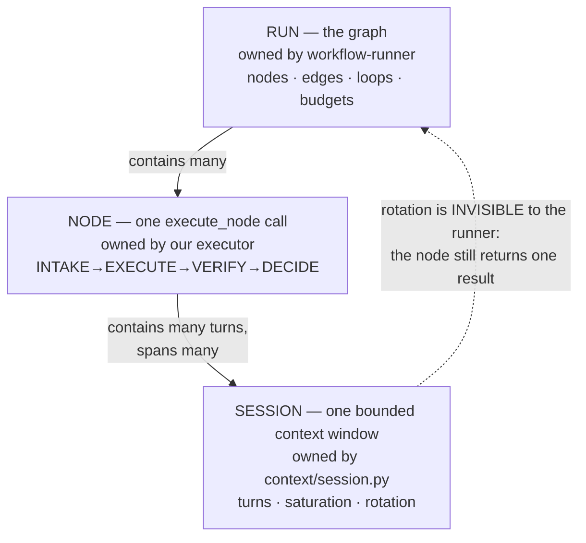
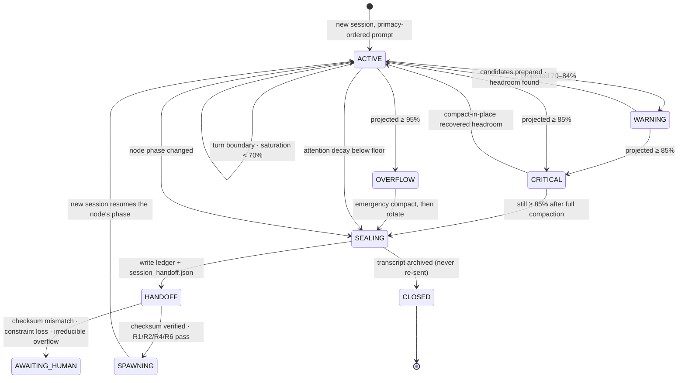
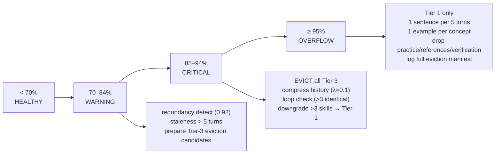
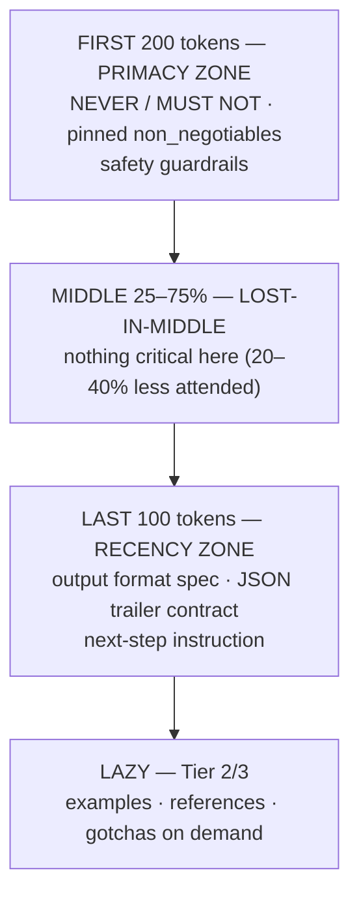

# AgentOrg — Design: Session & Context Lifecycle

How an agent's context is measured, compacted, rotated and handed off when it
approaches the model's window limit.

## 1. Three clocks, not one

The single most important framing: there are **three distinct lifetimes**, and
conflating them is what causes context bugs.



A node can span many sessions. When a session rotates, **the runner never
knows** — `execute_node` still returns exactly one dict. Session lifecycle is
internal to the executor. This is why session state is **per-agent**, not
per-node.

## 2. Thresholds (from `context-compaction-strategies`)

| Band | Saturation | Action |
|---|---|---|
| HEALTHY | < 70% | nothing |
| WARNING | 70–84% | redundancy detection (0.92), staleness scoring (>5 turns), prepare Tier-3 eviction candidates |
| CRITICAL | 85–94% | evict all Tier 3, compress history (λ=0.1), unproductive-loop check (>3 identical), downgrade >3 skills to Tier 1 |
| OVERFLOW | ≥ 95% | Tier 1 only, 1 sentence per 5 turns, 1 example per concept, drop practice/references/verification, log full eviction manifest |

The library is explicit that the window size is not the real limit: *models
attend effectively to ~70% of context*. Compaction is about **attention
quality**, not capacity — which is why the trigger is proactive at 70%, not
reactive at 95%.

## 3. Session state machine



## 4. Pre-flight projection

Before **every** LLM call the executor projects and decides. Never send blind.

```
projected =  system_prompt_tokens
           + skill_bundle_tokens        (current tier)
           + pinned_L1_constraints      (IRREDUCIBLE)
           + recall_block_tokens        (memory, context-only)
           + artifact_refs_tokens
           + session_history_tokens     (REDUCIBLE)
           + new_message_tokens
           + output_reserve             (min(4096, 0.15 × window))

saturation = projected / context_window
```

| Class | Contents | Shrinkable? |
|---|---|---|
| **Irreducible** | system prompt, skill Tier-1 route, pinned NEVER/MUST NOT + `non_negotiable` constraints, the current task statement | **No** |
| **Reducible** | session history, Tier-2/3 skill sections, artifact bodies, recall block, examples | Yes |

**If irreducible alone ≥ 85% → rotation will not help.** That is a hard signal,
not a rotation trigger: lower the skill tier, shrink the recall block, or raise
`context_window` in config. Rotating there would burn a session for nothing, so
the design refuses and escalates with that diagnosis. This distinguishes "too
much history" (rotate) from "too big a prompt" (tune).

Token counting uses a calibrated estimator corrected against the **actual**
`usage` every call, so drift self-corrects rather than accumulating.

## 5. The compaction ladder



Two rules are **non-negotiable in code**, not prompts:

- **AR-04 — verbatim preservation.** Sections matching
  `NEVER|MUST NOT|SECURITY|AUTH|COMPLIANCE` and every `non_negotiable: true`
  constraint are never lossy-compacted. A post-pass counts them; if the count
  drops, compaction is **reverted** and they are re-pinned. This is how "NEVER
  store passwords in plaintext" does not degrade into "use secure auth".
- **AR-05 — turn boundaries only.** Compaction and rotation happen only between
  turns, after a state-ledger checkpoint. Never during active generation.

### Cache-aligned eviction (`context/cachealign.py`)

A provider reuses a request only up to its **first changed byte**, so removing a
turn from the middle of the log invalidates every turn after it and the engine
re-pays for bytes it already sent. Eviction therefore removes one **contiguous
run** of evictable turns rather than scattered ones, so what remains still begins
with the bytes that were sent. Two consequences:

- The staleness score still chooses *which* run goes — a cheap adjacent pair beats
  an expensive single turn — so priority-based eviction is preserved. Alignment
  constrains only the **shape** of the removal.
- When the durable `CacheStore` reports this prefix **warm**, the run that leaves
  the longest byte-identical head is preferred; with no warm signal, attention
  leads and the oldest qualifying run breaks the tie. A compaction that breaks a
  warm prefix is recorded attributably (`invalidated_prefix`), naming the prefix
  hash and the character at which the cut fell, rather than being silent.

AR-04 is unaffected: protected turns are absent from the candidate list, so a run
cannot straddle one, and the pin-count guard still reverts the whole compaction.

## 6. Rotation triggers and guards

| Trigger | Condition | Why |
|---|---|---|
| **Capacity** | still ≥ 85% after the full compaction ladder | In-session compaction is exhausted |
| **Attention decay** | `e^(−0.1·turns) < 0.30` (≈ turn 12) | The library's "reasoning degrades after turn 12+" — a ground rule read at turn 1 is only ~60% as likely to be followed by turn 15. Rotation is **attention renewal** |
| **Phase change** | node advances INTAKE→EXECUTE→VERIFY→DECIDE | A phase change is a natural checkpoint; carried-over research context becomes noise |

| Guard | Rule | Why |
|---|---|---|
| **No-progress** | if a *fresh* session immediately projects ≥ 85%, do not rotate again | Irreducible content is too large; rotation cannot fix it |
| **Rotation cap** | max rotations per node (default 4) and per run | Mirrors the loop `max_iterations` discipline |
| **Checksum** | `session_handoff.json` sha256 verified before the new session starts | R4 — mismatch aborts, never propagates bad state |

## 7. The rotation handoff artifact

Reuses `agent-handoff-protocol` Phase 1's serialization, extended for session
continuity:

```json
{
  "handoff_version": "1.0.0",
  "kind": "session-rotation",
  "run_id": "run_…", "node_id": "fixer", "agent_id": "ag_7f3a",
  "agent_name": "Alice", "skill": "backend-developer",
  "from_session": "ses_004", "to_session": "ses_005",
  "node_phase": "EXECUTE", "attempt": 2,
  "reason": "capacity", "saturation_at_rotation": 0.87,
  "constraints": [
    {"type": "security", "value": "NEVER store passwords in plaintext",
     "source": "code-reviewer", "non_negotiable": true}
  ],
  "decisions": [
    {"gate": "auth-strategy", "choice": "argon2id", "rationale": "…",
     "rejected_alternatives": ["bcrypt"], "confidence": "high",
     "reversible": false, "timestamp": "…"}
  ],
  "artifacts": [
    {"type": "change", "path": "src/app.py", "sha": "…", "status": "in_progress"}
  ],
  "open_questions": [],
  "context_pruned": {
    "removed_sections": ["research-transcript", "tier3-examples"],
    "token_budget_before": 148000, "token_budget_after": 9400,
    "pruning_rules_applied": ["evict-tier3", "compress-history-lambda-0.1"],
    "preserved_verbatim_count": 7
  },
  "verification_evidence": [],
  "checksum": "sha256:…"
}
```

**R1 caps this at 12,000 tokens** — a fresh session's handoff is bounded by
construction.

## 8. New-session assembly — ordered, not just smaller



Rotation is therefore not merely compaction: it **re-pins decaying guardrails to
the primacy zone**, the library's remedy for attention decay. A rotated session
is *safer* than a bloated one, not just smaller. (Library rule 8: never place
critical guardrails in the 25–75% mid-context band, where the model is 20–40%
less likely to attend.)

## 9. Three distinct primitives — and a rule conflict resolved

| Primitive | From → To | Scope | Lifetime |
|---|---|---|---|
| **SessionRotation** | same agent, `ses_n` → `ses_n+1` | one agent's context | within a node |
| **AgentHandoff** | different agent, A → B | work transfer | node → node |
| **RunMemory** | run → future runs | durable learning | across runs |

**The conflict worth flagging:** `agent-handoff-protocol` **R3 forbids
self-handoff** (`origin_skill == target_skill`). A session rotation *keeps the
same skill*, so implemented naively as a handoff it would trip R3.

`SessionRotation` is therefore a **distinct primitive**, exempt from R3 by
construction (its payload declares `kind: "session-rotation"`), while remaining
subject to **R1** (≤12,000 tokens), **R2** (no `non_negotiable` loss), **R4**
(checksum), and **R6** (>3 open questions → escalate). R3 exists to catch an
accidental skill self-loop, not a deliberate context renewal.

## 10. Events and configuration

**Events:** `session.open` · `session.saturation{saturation, band, projected}` ·
`session.compact{tier, evicted, preserved_verbatim, aligned, prefix_chars_kept}` ·
`session.cache_invalidated{prefix_hash, skill, prefix_chars_kept, reason}` ·
`prefix.drift{skill, reasons, pinned, current}` · `prefix.resumed{skill, prefix}` ·
`session.rotate.requested{reason, saturation}` · `session.sealed{checksum}` ·
`session.handoff.verified` · `session.closed` · `context.irreducible_overflow` ·
`attention.decay{turns, weight}`

```json
{ "models": { "qwen2.5-coder": { "context_window": 32768, "max_output": 8192 } } }
```
```json
{ "context": { "compact_at": 0.70, "evict_at": 0.85, "overflow_at": 0.95,
               "attention_floor": 0.30, "max_rotations_per_node": 4,
               "rotate_on_phase_change": true } }
```

## 11. Failure modes designed against

| Failure | Symptom | Guard |
|---|---|---|
| Reactive compaction | Summarizer runs on a degraded, near-full context | Proactive at 70% (AR-03) |
| Security constraint loss | "NEVER plaintext" → "use secure auth" | AR-04 verbatim pass + count check + revert |
| Mid-turn compaction | Pruned references corrupt output | AR-05 turn-boundary only |
| Rotation storm | Fresh session immediately full, rotates forever | No-progress guard + rotation cap |
| Attention decay | Agent ignores rules at turn 15 | Decay trigger + primacy re-pinning |
| Handoff corruption | New session inherits bad state | sha256 verify (R4), abort on mismatch |
| Unbounded handoff payload | Fresh session starts bloated | R1 ≤12,000 token cap |
| Transcript re-injection | Closed session's log leaks back | Transcript archived, never re-sent |
| Irreducible overflow | Rotation loops without helping | Refuse to rotate; escalate with diagnosis |
| Prompt-injected skill body | A SKILL.md redirects the orchestrator | Skill content contained to its prompt slot |
