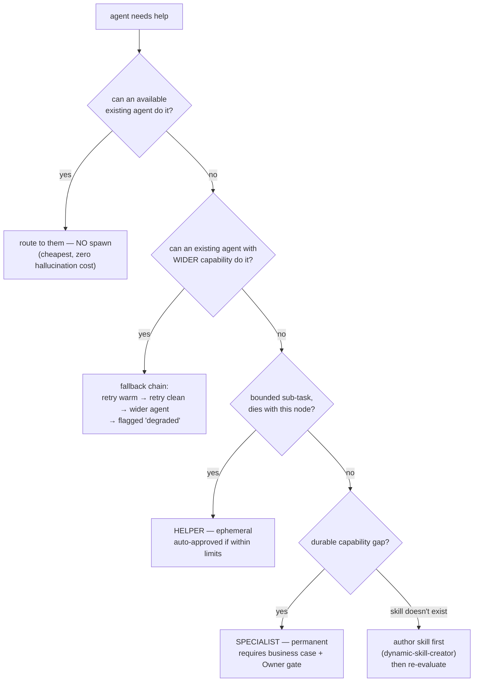
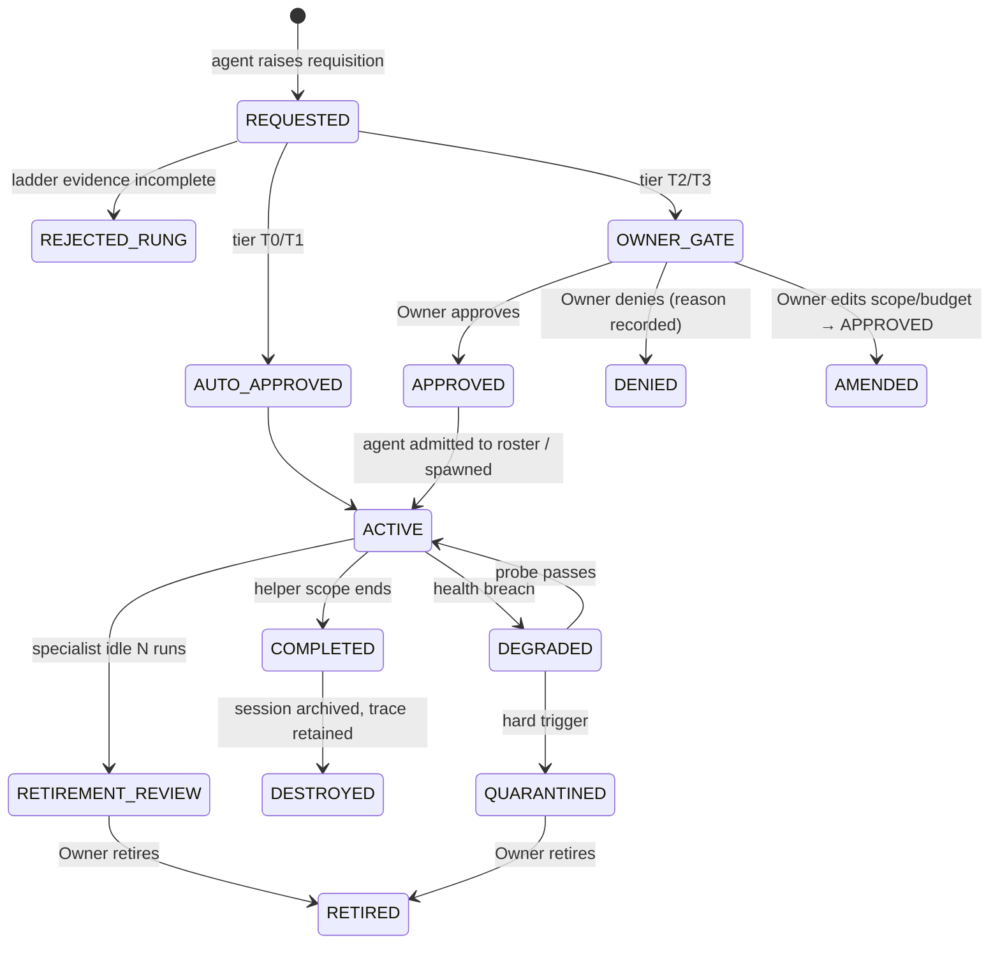

# AgentOrg — Design: Delegation & Agent Spawning

How an agent hires help — temporary or permanent — and why that is safe.

## 1. Taxonomy

Three distinct things get conflated; separating them makes policy tractable.

| Kind | Lifetime | Who decides | Graph effect | Cost profile |
|---|---|---|---|---|
| **Helper** (temporary) | dies when the task/session closes | requesting agent, **auto** | none — internal worker inside one node | small, scoped, budget-partitioned |
| **Specialist** (permanent) | persists across runs until retired | agent proposes → **Owner approves** | adds a durable agent bindable by future nodes | durable identity, standing budget |
| **Twin** (peer) | one fan-out | system | supervisor worker | same skill, different model, for independence |

**Temporary = Helper**, **permanent = Specialist**, and the auto-vs-human
decision is driven by **cost and reversibility**, not by kind alone.

## 2. The ladder that comes before spawning

**Spawning is the last resort, not the first.** The library warns that delegation
leaks show up as token-per-task growing >20% week-over-week. Every "I need help"
request walks this ladder and must document why it fell through earlier rungs:



Rungs 1 and 2 are free wins, which is why they come first — and why the
requisition must record that they were tried.

## 3. The Requisition — the "detailed reason why"

Modeled on a hiring requisition, and per `recruiting` R1 it must state a
**capability gap and outcomes**, not a wish for help.

```json
{
  "requisition_version": "1.0.0",
  "requester": { "agent_id": "ag_7f3a", "name": "Alice", "skill": "backend-developer" },
  "trigger": { "run_id": "run_…", "node_id": "fixer", "task_id": "task_014",
               "delegation_depth": 1, "chain": ["ag_3b1c", "ag_7f3a"] },
  "capability_gap": {
    "needed": ["kubernetes", "helm"],
    "why_existing_insufficient": "no active agent declares these; the closest (ag_9c1d) covers only Docker"
  },
  "ladder_evidence": {
    "reuse_attempted": [{ "agent_id": "ag_9c1d", "why_rejected": "capability mismatch: docker ≠ k8s" }],
    "wider_agent_attempted": [{ "agent_id": "ag_5e2f", "outcome": "timeout at 2s" }],
    "why_not_self": "would require 3 hops of context the requester does not have"
  },
  "proposed": {
    "kind": "helper", "skill": "devops-engineer", "provider": "ollama", "model": "qwen2.5-coder",
    "capabilities": ["read:src/**", "write:deploy/**"],
    "scope": "node-scoped", "requested_budget": { "max_tokens": 40000, "max_usd": 0.00 }
  },
  "expected_outcome": "unblocks node 'fixer'; produces deploy/ manifests satisfying the node contract",
  "confidence": "high",
  "cost_of_not_doing": "node escalates to Owner gate; estimated +1 human cycle"
}
```

Three fields carry the weight: **`capability_gap`** (the real reason),
**`ladder_evidence`** (proof reuse was tried first), and **`expected_outcome`**
(the outcome, not the request). A requisition missing any of them is **rejected
automatically**.

## 4. Approval authority — tiered

"Auto or human approved" is a **threshold table**, and it is not a new
mechanism — it is route-class `R-DELEGATE` resolved by the autonomy policy.

| Tier | Conditions | Decision | Rationale |
|---|---|---|---|
| **T0 — auto** | helper · existing skill · within parent budget · depth ≤ 3 · no new capability domain | **auto**, notify | Cheap, reversible, dies with the task |
| **T1 — auto+notify** | helper · catalog-known skill · low budget · read-only capabilities | **auto**, notify with requisition | Still reversible; Owner sees the trail |
| **T2 — Owner gate** | specialist (permanent) · or write/deploy capabilities · or budget > threshold | **confirm** — Owner sees full requisition | Durable and consequential |
| **T3 — Owner gate, explicit** | new capability domain · elevated privileges · budget > high threshold · depth > 2 | **confirm** + explicit acknowledgment | Highest risk; mirrors above-band hiring |

Tiers are config-driven, so "auto vs human" is a setting, not hardcoded — and
each tier records *why it landed there*.

## 5. Hard invariants — enforced in code, never requested

| # | Invariant | Precedent |
|---|---|---|
| **S1** | **Depth cap 3** — a 4th hop is refused with a clear error | `multi-agent-orchestration` default |
| **S2** | **Cycle detection** — refuse if the target is already in the active chain (A→B→A) | "rejects any agent already present in the active delegation chain" |
| **S3** | **Budget partitioning, not creation** — a child's budget is *carved out of* the parent's remaining budget; the total never exceeds the run ceiling | Required: without it, fan-out is unbounded spend |
| **S4** | **Least-privilege capabilities** — the child receives an explicit enforced capability set, never the parent's full set | `plugin-ecosystem-architect` R3 |
| **S5** | **Five-element context pass-through** on every delegation | `multi-agent-orchestration`: problem, tried, logs, file paths, hypothesis |
| **S6** | **Lineage + audit** — parent, chain, requisition, approver and tier recorded for every spawn | Trace-first principle |

**S3 is the one most systems get wrong.** If spawning *creates* budget, an agent
tree can spend without bound; if it *partitions*, a run's ceiling holds no matter
how the tree fans out.

## 6. Anti-sprawl and the org chart

Hallucination compounds ~15–20% per hop, and cost leaks silently, so spawning
needs counter-pressure:

| Control | Rule |
|---|---|
| **Span of control** | A parent may hold ≤5 concurrent active reports (default). Beyond that it must justify or route to a peer |
| **Anti-sprawl metric** | **token-per-completed-task** per agent and per run; >20% growth over a rolling window raises `agent.sprawl.suspected` |
| **Helper reuse first** | A helper matching an existing (even idle) agent is rejected; the router reuses instead |
| **Retirement path** | Helpers are destroyed at scope end. Specialists unused for N runs are flagged `retirement_review` |
| **Verification beyond depth 2** | Past 2 hops the result must be verified by an agent *that is not the requester* — countering compounding hallucination via the independence principle |

## 7. Lifecycle



Denials are recorded **with reason** and fed back to the requester, so an agent
learns which requests were unjustified rather than retrying blindly.

## 8. Failure modes designed against

| Failure | Symptom | Guard |
|---|---|---|
| Infinite delegation loop | A→B→A burns $500 in 8 min | S2 cycle detection + S1 depth cap |
| Hallucination cascade | Downstream amplifies upstream error | Depth cap + five-element context + independent verification past depth 2 |
| Cost explosion | Fan-out spends without bound | S3 budget partitioning + run ceiling kill switch |
| Privilege escalation | Child inherits parent's broad access | S4 least-privilege enforced set |
| Context-poor delegation | Second agent re-discovers from scratch | S5 five-element pass-through, mandatory |
| Agent sprawl | Roster explodes; token-per-task climbs | Reuse-first ladder + span of control + anti-sprawl metric |
| Orphaned agents | Nobody knows who spawned what | S6 lineage + audit; retirement path |
| Silent denial | Agent retries a rejected request forever | Denials recorded with reason and surfaced |
| Supervisor bottleneck | One agent holds 50 reports | Span-of-control cap → route to peer / escalate |
| Unjustified hires | "I need help" with no gap stated | Requisition schema rejects incomplete requests |
