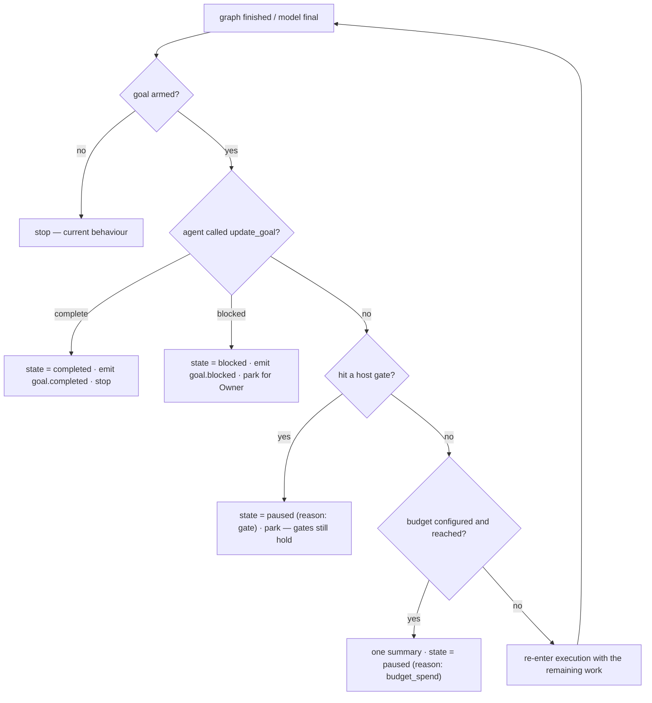
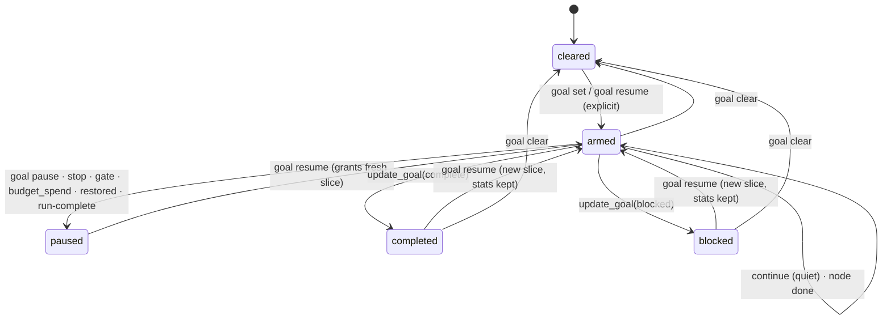

# AgentOrg — Design: The Goal Runtime

How a goal you state keeps being worked on — across turns, across a model
finishing, and across a restart — until it is done, blocked, or you stop it.

Second of three amendments:

| Amendment | Question it answers |
|---|---|
| [`DESIGN-WORKSPACE.md`](DESIGN-WORKSPACE.md) | *Which folder is the code?* |
| **DESIGN-GOAL.md** (this) | *What does "keep going" mean?* |
| [`DESIGN-SUBAGENTS.md`](DESIGN-SUBAGENTS.md) | *How is parallel work isolated and read back?* |

---

## 1. The problem stated exactly

Today a run is **bounded and gate-terminated**:

- `Orchestrator.prepare(goal, max_iterations=3)` plans a graph, and the graph's
  review loop is capped at three passes.
- The run reaches a terminal-looking phase and **stops** — at `AWAITING_GATE`, or
  when the nodes are done.
- Nothing continues after a model turn ends. There is no objective that outlives a
  graph.

That is correct for "run this plan". It is wrong for the thing you actually asked
for: *state a goal, attach a folder, close the laptop, come back later*. Today the
answer between those two points is "nothing happens".

## 2. What a Goal is — and is not

A **Goal** is a durable, ownable objective that stays **armed** until it is
completed, blocked, paused, cleared, or budget-exhausted. It is *not* a graph, a
plan, or a quality gate.

| Thing | Lifetime | Who ends it | Persisted |
|---|---|---|---|
| **Node** | one `execute_node` | the executor | in the checkpoint |
| **Run** | one graph execution | gates / completion | in `run_state.json` |
| **Goal** | many runs | the agent (`update_goal`) or the Owner | **`goal.json`** |

The crucial property, and the one that makes this safe: **a Goal decides
completion, not the host.** No node-percentage, no todo count and no evaluator
declares the objective met. The agent says *done* or *blocked* through
`update_goal`; the host's only job is to keep the loop honest, bounded by whatever
ceiling you set, and cheap to stop.

## 3. Durable state, disarmed on load

The goal is a **versioned projection**, written atomically beside the run state:

```jsonc
// <workspace>/.agent_state/goal.json
{
  "goal_version": "1.0.0",
  "objective": "Add cursor pagination to /v1/items with tests",
  "state": "armed",              // armed | paused | completed | blocked | cleared
  "armed_at": "2026-…Z",
  "armed_by": "owner",           // owner | cli | app
  "pause_reason": null,          // budget_spend | manual | gate | restored | run-complete
  "token_budget": 0,             // 0 = OFF (see §5)
  "spend": { "rounds": 0, "tokens": 0, "requests": 0, "cost_usd": 0.0 },
  "history": [ { "at": "…", "kind": "continue|pause|resume|complete|blocked",
                 "detail": "…" } ]
}
```

Two rules, both deliberate:

- **Written atomically and schema-versioned**, exactly like `run_state.json`
  (temp + `os.replace` + fsync). A torn goal is worse than an old one.
- **Loaded disarmed.** On load — from disk, after a restart, on a fork or an import
  — the goal comes back `paused` with `pause_reason: "restored"`, and requires an
  **explicit** `goal resume` to continue. This is the single most important safety
  property here: a goal must never re-arm itself because a process restarted. An
  unattended loop that resumes itself on boot is an unbounded spend you did not
  authorise.

Activation is therefore **process-local and explicit**; durability is the file.

## 4. The idle driver — where "continue" actually happens

Continuation is a transition, not a thread. After the orchestrator finishes
executing a graph (or the executor returns a node's final), control reaches one
place that decides whether to go again:



Three things this states plainly:

- **It re-enters execution, it does not re-plan by default.** A Goal advances the
  work; it does not silently rewrite the approved graph on every iteration. A
  re-plan is a scope change and is treated as one (see §7).
- **Gates still hold — by policy.** A Goal respects a *terminal* gate (`kind: human`: release, close,
  spend) and an agent gate with no untried route as *blockers*, always. It passes the gates the *org*
  can decide (the bounded-reroute agent gate, a policy route class the config already answered) when
  the goal's policy authorises it — which is the default. A goal that chose `--human-gate` parks at
  every gate. This is the reconciliation between "Reasonix has no host quality gate" and AgentOrg's
  first-class gate: a gate is a genuine user decision, and the question is only *whether this objective
  was given the authority to make the decidable ones*. See
  [`DESIGN-DEFAULTS-AUTONOMY.md`](DESIGN-DEFAULTS-AUTONOMY.md).
- **There is no per-turn "continue" report.** Continuing is the norm; only the
  transitions above are emitted. A loop that announces every iteration is noise,
  and the trace already has the node events.

## 5. Budget: off by default, and what that costs

`token_budget = 0` means **no ceiling**. That is the Reasonix behaviour and it is
what you chose. Stated plainly, it is also the one place this design weakens a
guarantee the rest of the project holds: *"an ungoverned loop is an unbounded bill,
which is the one failure this project treats as unacceptable everywhere else."*
So the default is honoured **and** its blast radius is contained rather than
ignored:

- A Goal only exists when **explicitly armed** — never inferred, never restored
  armed, never armed as a side effect of `run`.
- It is **paused by any of**: `goal pause`, engine stop, a gate, an unrecoverable
  provider error, a set budget being reached, or a round that advanced nothing —
  `run-complete`, which is a finished graph the engine stops looping over (§9).
- **Cumulative statistics are always tracked** (`rounds`, `tokens`, `requests`,
  `cost_usd`) and shown live, so "no ceiling" never means "no idea what it is
  costing". The console's **Cost** tab already has the surface.
- Setting a budget is one line and is *resumably* enforceable:

```toml
[agent]
goal_token_budget = 20000000   # 0 = off (default)
```

Reaching a positive budget produces **one summary** and a `budget_spend` pause.
`goal resume` grants a **fresh configured slice** while the cumulative stats stay
intact — so spend is bounded per slice and fully visible across slices, and a
resume is an explicit act, not an automatic reset.

## 6. The `update_goal` tool

Completion is a **tool call**, because that is the only thing the agent can do that
the host can trust as deliberate:

| Call | Effect |
|---|---|
| `update_goal(complete, summary)` | `state = completed`; the summary is the goal's final report |
| `update_goal(blocked, reason)` | `state = blocked`; the reason is surfaced and waits for the Owner |

Registered in `tools.py` like any other tool (so it is capability-gated and appears
in the tool schema hash), but only advertised when a goal is armed — the same
instinct as `read_only`: a capability that is not in play is not in the prefix.
Because it is part of the tool block, arming a goal is a **cache-shape change**;
`prefix.py` / `cache.py` will attribute the resulting miss by name, as they do for
any tool-set change.

## 7. Scope changes

A Goal may find that the objective needs work the approved graph does not contain.
There are two honest options and the design picks by reversibility, consistent with
`DESIGN-ROUTING.md`:

- **Advance within the graph** (the default): run remaining nodes, re-run a bounded
  review loop, drain the task pool.
- **Re-plan** (a scope change): allowed, but it produces a **new manifest and a
  gate** — you approve the widened scope rather than discovering it in the diff.

A Goal never silently expands the graph it was approved against.

## 8. Protocol surface



New events (mirrored in the Swift `EventType` so the two cannot drift):

| Event | Meaning |
|---|---|
| `goal.armed` / `goal.resumed` | the loop is live |
| `goal.progress` | a quiet round boundary — **not** once per turn |
| `goal.paused` | with `reason`: `manual` \| `gate` \| `budget_spend` \| `restored` \| `run-complete` |
| `goal.completed` / `goal.blocked` | the agent's own verdict |
| `goal.cleared` | objective removed |

New commands: `goal set`, `goal status`, `goal pause`, `goal resume`, `goal clear`
— the same five Reasonix exposes, so the vocabulary transfers.

```bash
engine.cli goal set "Add cursor pagination to /v1/items with tests" --project ~/code/my-app
engine.cli goal status  --project ~/code/my-app      # state, rounds, tokens, cost
engine.cli goal pause   --project ~/code/my-app
engine.cli goal resume  --project ~/code/my-app      # grants a fresh slice
```

The console gains a Goal row in the **Work** tab (state, rounds, spend) and
`⌘⇧G` to set/arm — the Work tab already answers *"where is work stuck?"*, and a
paused goal is exactly that.

## 9. Failure modes designed against

| Failure | Symptom | Guard |
|---|---|---|
| Self-resuming after restart | An unattended loop spends overnight | Loaded **disarmed**; resume is explicit |
| Unbounded spend by accident | The bill arrives before the result | Off-by-default is opt-in only; cumulative stats always on; kill switch; gates hold |
| Loop that never converges | Same tool call forever | Consecutive-identical-call reminders at the **3rd, 5th, 8th**; calls still execute, but the trace shows the stall (`goal.progress` + `loop.stagnation`) |
| Silent goal completion | "done" with nothing to show | `update_goal(complete)` requires a summary; it becomes the goal's report |
| Goal and run disagree | Work continues against a graph nobody approved | Re-plan is a gate, not a silent rewrite |
| Stale goal after re-attach | Yesterday's objective drives today's repo | Goal is per-workspace in `.agent_state/`; attach reports an existing one and resumes it only on request |
| Two goals at once | Ambiguous objective | One goal per workspace; `goal set` replaces with the previous one kept in `history` |
| Finished graph that never reports | `done` is reached and then never printed: a no-op round every ~0.3s, one runner process each, until the 10,000-round cap | A round that leaves the runner's checkpoint unchanged stops the loop and pauses the goal (`run-complete`), so the cap stays the backstop it is documented as |

## 10. Trade-offs

- **No host completion gate is a real risk.** The failure mode is an agent that
  believes it is done (or never is) and the host not knowing. The mitigation is
  visibility, not a gate: completion is a *statement with a summary*, the trace
  records every round, and the console shows spend. If you later want a hard gate,
  it is one `confirm` policy on the completion — deliberately not the default,
  because a host that second-guesses "done" is exactly the behaviour this design
  rejects.
- **Quiet continuation hides liveness.** "No per-turn report" means a wedged goal
  and a working one look similar from the UI. The `goal.progress` round boundary
  and the existing heartbeat/host liveness check are what distinguish them; they
  must both be on for a Goal run.
- **Disarm-on-load is mildly annoying.** Every restart needs one explicit resume.
  That friction is the feature — it is the difference between a tool you leave
  running and a bill you cannot stop.

## 11. What was built, and the choices made

The open questions above were **decided and implemented**:

1. **A Goal parks at a gate — unless it was given the authority not to.** Arming an objective is
   standing authorisation to pass the gates the *org* can decide (the agent gate, a policy route class
   the config already answered) and to staff its own gaps. A **terminal** gate (`kind: human`:
   release, close, spend) is never passed, and a goal that chose `--human-gate` parks at every gate.
   The polarity is autonomous-by-default because the product is a tool you leave running; see
   [`DESIGN-DEFAULTS-AUTONOMY.md`](DESIGN-DEFAULTS-AUTONOMY.md) for the reasoning and the safety
   argument. `goal.auto_pass_auto_gates` (config) and `GoalPolicy` (per goal) are the two switches.
2. **A Goal never re-plans silently.** Advancing within the approved graph is the default; a widened
   scope is a new manifest and a gate.
3. **Reminder thresholds are configurable** — `goal.repeat_call_reminders`, default `(3, 5, 8)`.
4. **`resume` grants an equal fresh slice**, and the cumulative totals are kept, so spend is bounded
   per slice and visible across them.

One addition the design did not call for but the implementation needed: `_run_with_goal` also carries
an unconditional **round cap** (`goal.max_rounds`, default 10 000). The token budget is opt-in, so
without it a bug in the loop itself — a gate that never settles, a decision never written — would spin
forever. It is a backstop, not the practical limit.

Shipped as:

| Surface | Where |
|---|---|
| `Goal`, `GoalState`, `GoalSpend`, `GoalDecision` | `engine/goal.py` |
| `[goal]` config (`token_budget` 0 = off) | `engine/config.py` |
| `goal.*` events, `goal_*` commands | `engine/protocol.py` |
| `update_goal` tool (advertised only when armed) | `engine/tools.py` |
| `_run_with_goal` idle driver; `goal_*` API | `engine/orchestrator.py` |
| `goal set\|status\|pause\|resume\|clear` | `engine/cli.py` |
| Goal in every snapshot + goal commands | `engine/serve.py` |
| Goal menu, Work-panel controls, status bar | `App.swift`, `Panels.swift`, `ConsoleView.swift` |
