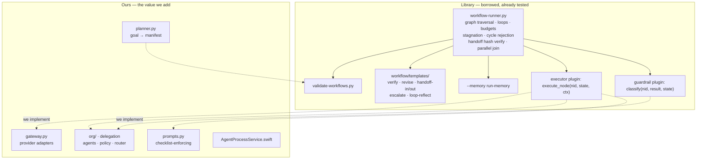
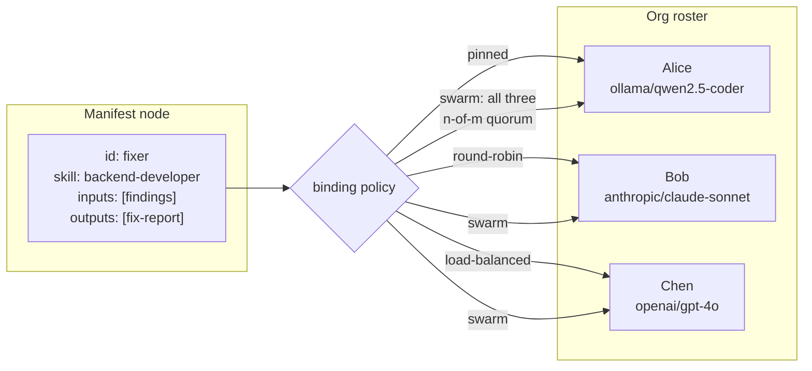
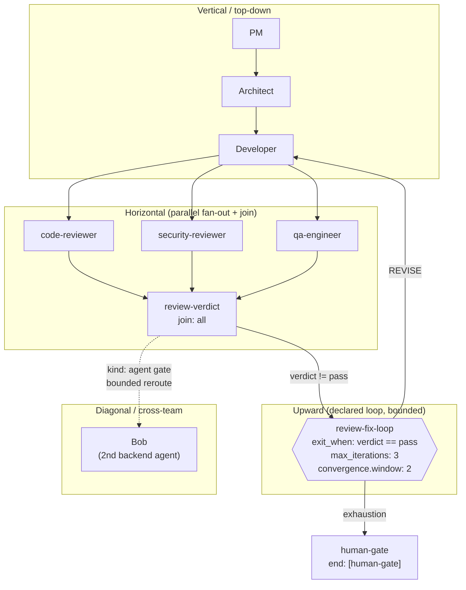
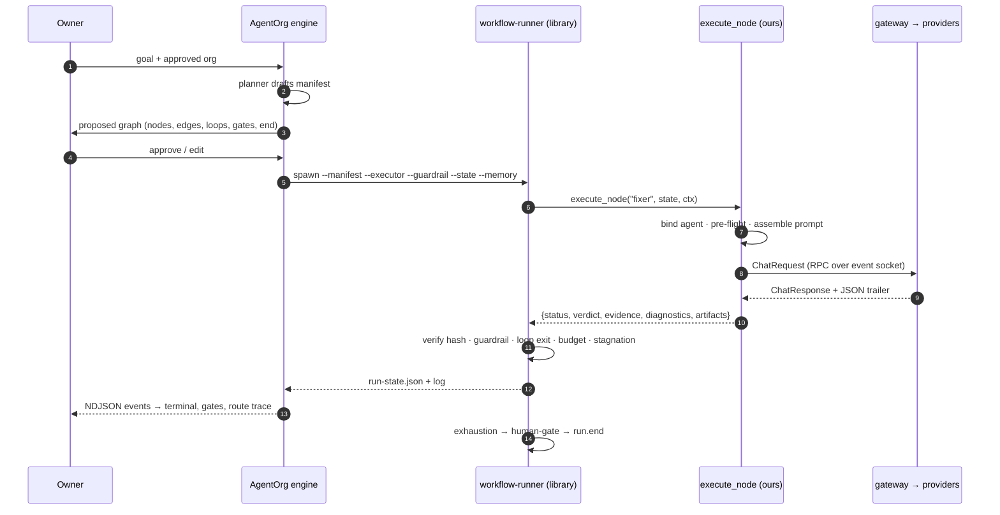

# AgentOrg — Design: Graph & Handoffs

How work flows: loops, graphs, handoffs in any direction, and how a run ends.

## 1. The three-layer model (borrowed from the library)

The Skills library defines a workflow system we build directly on rather than
reinvent (`WORKFLOW-SYSTEM.md`):

```
┌────────────────────────────────────────────────────────────────────────┐
│  L2  EXECUTION  run-state JSON + loop protocol + boundary templates   │
│      (the runner does control flow; the agent does content)           │
├────────────────────────────────────────────────────────────────────────┤
│  L1  MANIFEST   workflow YAML: nodes / edges / loops / gates          │
├────────────────────────────────────────────────────────────────────────┤
│  L0  CONTRACT   optional "workflow:" frontmatter on a SKILL.md        │
└────────────────────────────────────────────────────────────────────────┘
```

We own **L0 consumption** (parsing contracts into `SkillBundle`), **L1
authoring** (the planner), and **L2 execution** (the `execute_node` executor and
its guardrail). The runner that traverses L1 is the library's, unmodified.

## 2. Responsibility split



**We write the plugins, not the engine.** Our code answers *"who does this node
and what do they say"*; the library answers *"what happens next, and is it
allowed."*

## 3. Node ⇄ agent binding — how "many agents per skill" becomes real

A **node names a capability; the org supplies the headcount.**



Binding modes: `pinned`, `round-robin`, `load-balanced`, `swarm`. Two refusals
are structural, not advisory:

- The **reviewer node cannot bind to the artifact's producer** (independence).
- A node cannot bind to an agent whose model has an **unmeasured
  `context_window`** (the session projection depends on it).

## 4. Handoffs in any direction



**One honest constraint.** Arbitrary backward or upward edges must be **declared
as a `loops:` block**. Undeclared cycles are rejected by the validator. "Any
direction" is real; a backward edge is a loop with an `exit_when` and a budget,
not a free-form jump. That is the difference between a graph that converges and
one that spins.

## 5. Node types

| `type` | Role | Notes |
|---|---|---|
| `skill` | Executes one library skill | Default. Carries `inputs`/`outputs`. |
| `gate` | Checkpoint, no content work | `kind: human` (terminal authority) or `kind: agent` (bounded reroute before a human) |
| `supervisor` | Routing node | Delegates to `workers`; owns its fan-out. **Our concurrency lives here.** |
| `task` | Non-skill work | Reserved. |

The library's runner is **single-threaded** — its `parallel:` blocks are *join
semantics* ("member edges fire only after the whole group has joined"), not
concurrency. Real parallelism therefore comes from supervisor nodes, whose
fan-out we implement in `executor.py` with a bounded worker pool.

## 6. Execution flow



The executor streams UI events over a **Unix domain socket**
(`AGENTORG_EVENT_SOCK`), not stdout — injecting events into the runner's stdout
would corrupt its protocol.

## 7. Node lifecycle and the loop protocol

```
INTAKE  →  EXECUTE  →  VERIFY  →  DECIDE
                                    ├─ DONE      → write handoff payload, advance edges
                                    ├─ REVISE    → write diagnostics, iterate (budget guard)
                                    └─ ESCALATE  → exhaustion / blockage → gate or report
```

Loop protocol, runner-enforced:

1. Pass N runs the loop's nodes in order against current run-state.
2. Exit check: `exit_when` true → loop complete, advance.
3. Delta check: no change for `convergence.window` passes → treat as exhaustion.
4. Budget check: `iteration >= max_iterations` → exhaustion.
5. Exhaustion follows `escalate_to`, carrying full context.
6. Never stop silently; never continue past budget; never repeat an identical pass.

## 8. Termination — three authorities

| Authority | Mechanism | Bypassable? |
|---|---|---|
| Graph | `end:` node reached | No — validator requires reachability |
| Convergence | `exit_when` true | No — evaluated by the runner |
| Budget | `max_iterations`, `max_steps`, `convergence.window` | No — enforced in code |
| Human | terminal `kind: human` gate | No — `escalate_to` must resolve to it |
| Agent | `kind: agent` gate, bounded `max_reroutes` | Bounded, then escalates to the human |

An agent may end a run *within* its granted authority (convergence, bounded
reroute). Only the Owner holds terminal authority.

## 9. Failure modes designed against

| Failure | Symptom | Guard |
|---|---|---|
| Undeclared cycle | Graph spins forever | Validator rejects; runner tracks the node stack |
| Silent stop | Run ends with no verdict | Runner always produces a summary or escalation |
| Identical passes | Budget burns on no progress | Stagnation detector over `convergence.window` |
| State corruption | Downstream inherits bad state | Handoff sha256 verified; mismatch aborts |
| Parallel clobber | Two nodes write one field | Disjoint `fields` validated statically and at merge |
| Premature done | Completion claimed without evidence | `completion.criteria` + `evidence: required` gate |
| Refinement spiral | REVISE repeats the same action | Revise template's change-or-escalate rule + stagnation |
| Reviewer = producer | Self-approval | Binding refuses producer-as-reviewer |
