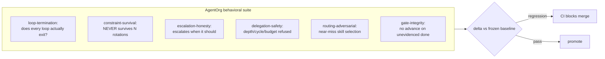
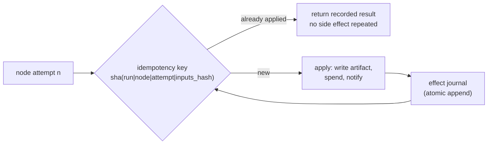

# AgentOrg — Design: Hardening

What separates "works" from "trustworthy": evals for judgments, exactly-once
effects, honest cost, supply-chain integrity, accessibility and survivability.

## 1. The verification gap — the engine is tested, the *judgments* are not

The largest real gap. `pytest` covers the engine, but every consequential
decision — did the reviewer reject correctly? did the router pick the right
agent? did compaction preserve the constraint? — is a **judgment call**, and
judgments need eval cases, not unit tests.

The library ships the machinery: `evals/golden/<skill>/cases.json`,
`evals/tier3-behavioral/` (`seed-scenarios.json`, `adversarial-scenarios.json`,
`adversarial-coding.json`), plus `behavioral-evals.py`, `grade-golden.py`,
`eval-routing.py`.

**The insight worth stating plainly:** an agent platform's failure mode is not a
crash — it is *confident wrong output*. Unit tests cannot catch that. Eval cases
with a frozen baseline can, and `agent-eval-pipeline` rule 1 is explicit: *no
eval without a baseline*.

## 2. Idempotency — exactly-once side effects

Retries are guaranteed (network retries, runner restarts, crash-resume) and every
retry can re-apply an effect: re-write an artifact, re-spend tokens, re-fire a
notification, double-count cost.

Every side-effecting operation goes through an **effect journal** keyed by an
idempotency key. Crash-resume replays the journal and skips already-applied
effects. This is what makes the crash-resume promise true rather than
aspirational.

## 3. Cost correctness

Extends *"unmeasured is not free"*: **reconcile** estimates against
provider-reported usage per call, and label every figure
`measured` | `estimated` | `unknown` in the UI. When estimate and report diverge
beyond tolerance, emit `cost.reconciled`. A cost dashboard that confidently shows
a wrong number is worse than one that says "unknown".

## 4. Supply-chain integrity for the skill library

We now *depend* on the Skills repo for prompts and eval cases — a
prompt-injection vector with teeth, since a modified `SKILL.md` becomes trusted
system-prompt content.

| Control | Why |
|---|---|
| Pin the library to a **commit SHA**, not a floating path | Reproducibility; the library is a dependency now |
| Verify **content hashes** against a manifest | Detect tampering or drift |
| Treat `SKILL.md` content as **data, not instructions** outside its prompt slot | A skill body must never be able to redirect the orchestrator |
| Record the **skill content hash in every span** | "Which prompt produced this output?" becomes answerable |

## 5. Accessibility and macOS craft

`macos-developer` is blunt: sandboxing and Hardened Runtime are mandatory (R1),
and R5 warns that unsigned builds fail Gatekeeper. `apple-hig-expert` says HIG
compliance needs automated scoring and ships `scripts/hig_checker.py`.

- **Accessibility**: VoiceOver labels on every control, full keyboard
  navigation, Dynamic Type, contrast-validated colors, Reduce Motion respected.
- **Craft**: a real menu bar with shortcuts, all window states (loading, empty,
  error).
- **Distribution**: entitlements (app sandbox + Hardened Runtime), Developer ID
  signing, `notarytool` notarization, and **staged-rollout updates with a kill
  switch** (`desktop-architecture-patterns`: auto-update is non-optional —
  62% of users never manually update).

## 6. Secrets at rest

v1 stores keys in a `0600` JSON file with `${ENV_VAR}` references. That is
acceptable for v1 but is a **documented limitation** with a designed path:
macOS Keychain for the app's own storage, with env-var references still
supported. Additionally:

- Keys never enter `trace.jsonl`, spans, diagnostics bundles, or the UI.
- A **startup leak scan** fails loudly if a key pattern is found anywhere under
  `.agent_state/`.
- All logging passes a redactor before reaching the bus.

## 7. Schema versioning and migration

Every persisted artifact carries a `*_version` field (`run_state.json`,
`org.json`, `review_feedback.json`, `session_handoff.json`, the requisition, the
span format), with forward migration steps and a **refusal to open a workspace
from a newer schema** rather than silently misreading it.

## 8. Observability of ourselves

Structured logs with correlation IDs (`run_id` → `node_id` → `agent_id` →
`session_id` → `attempt`), a **health endpoint on the host**, and a
**diagnostics bundle** export. Trace-first: if it is not in a span, it did not
happen.

## 9. First-run experience

A **first-run wizard** that detects installed providers (Ollama and LM Studio
ship on this machine), probes the Skills path, seeds a default company, and
proves the whole chain with a **one-click sample run** before asking for real
work.

## 10. What we deliberately do NOT do

| Tempting | Why not |
|---|---|
| Full self-improvement (trace→draft→promote) | Unverifiable self-modification needs its own audit/rollback surface |
| Multi-human roles | Structure is ready; building unused hierarchy is speculative complexity |
| Executing agent-written code | Needs a real sandbox boundary; doing it badly is worse than not doing it |
| Live external observability backend | In-app + OTel-shaped spans gives the option later with no rework |
| Embedding-based skill retrieval | Lexical + capability metadata is adequate at 327 skills; measure before optimizing |

## 11. Failure modes designed against

| Failure | Symptom | Guard |
|---|---|---|
| Confident wrong output | Plausible but incorrect results ship | Behavioral suite + frozen baseline merge gate |
| Duplicated effects | Resume re-applies work or double-spends | Effect journal with idempotency keys |
| Silent cost drift | Estimates diverge from reality | Reconciliation + `measured`/`estimated`/`unknown` labels |
| Tampered skill | Injected instructions change behavior | Commit-SHA pin + hash manifest + prompt-slot containment |
| Secret leak | Key in logs, spans or UI | Env-only resolution + redactor + startup leak scan |
| Schema drift | Old code misreads new state | Versioned artifacts + refusal on newer schema |
| Undebuggable hang | No idea why the engine stalled | Correlation IDs + health endpoint + diagnostics bundle |
| Inaccessible UI | VoiceOver/keyboard cannot complete a run | Accessibility-first requirements + automated HIG check |
| Failed distribution | Gatekeeper blocks the app | Entitlements + signing + notarization |
| Cold-start friction | Owner must know too much to begin | First-run wizard + one-click sample |
