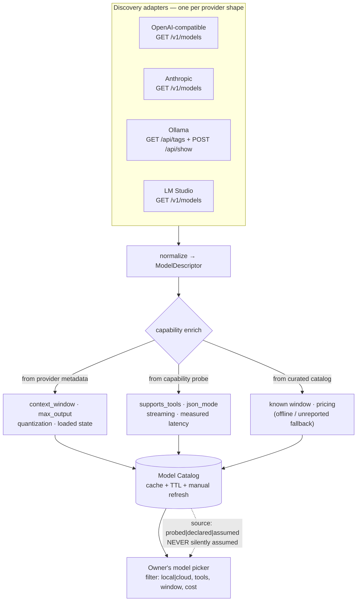
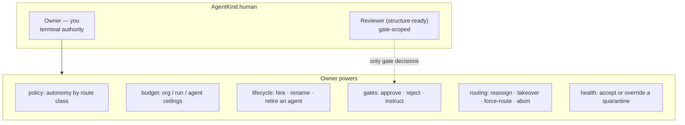
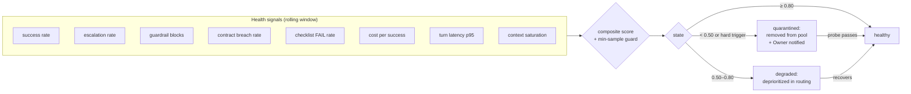
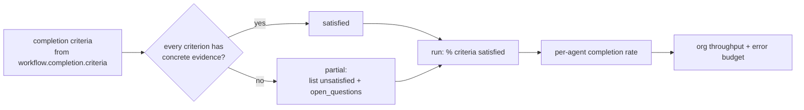
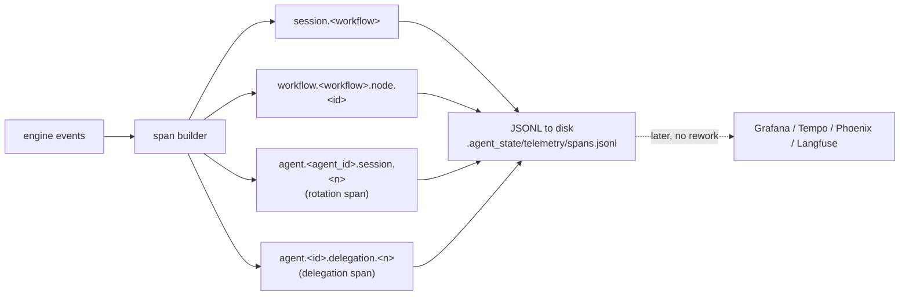

# AgentOrg — Design: Model Catalog, Ownership & Agent Health

How agents get their models, who owns the org, and how the Owner monitors the
health of agents and the completeness of work.

## 1. Provider model discovery — the catalog

The app must **ask each provider what it actually has** rather than shipping a
hardcoded list that rots.



```python
@dataclass(frozen=True)
class ModelDescriptor:
    provider_id: str; model_id: str; display_name: str
    context_window: int | None        # None = unknown, never guessed
    max_output: int | None
    supports_tools: bool | None       # None = unprobed
    supports_streaming: bool | None
    supports_json_mode: bool | None
    cost_in_per_1k: float | None; cost_out_per_1k: float | None
    locality: str                     # "local" | "cloud"
    quantization: str | None; loaded: bool | None
    source: str                       # "probed" | "declared" | "assumed"
```

| Rule | Why |
|---|---|
| **`None` means unknown, never a default** | A guessed `context_window` silently corrupts the pre-flight projection and causes real overflows |
| Every descriptor carries `source` | The picker shows *assumed* values distinctly, so the Owner knows what is verified |
| Cached with a TTL **plus** manual refresh, with an offline fallback | Local providers are often not running; the app must still open and let the Owner build an org |

Two consequences:

- An agent bound to a model whose `context_window` is `None` is **refused at
  binding time** — the session projection depends on that number being real.
- For Ollama specifically, `/api/tags` + `/api/show` give the **actual** context
  length and parameter size, so local models can be *probed-accurate* rather than
  assumed. That matters most for the local-model concurrency cap.

## 2. The Owner — a human principal with terminal authority



The Owner is `AgentKind.human`, `id: ag_owner`, `role: owner` — the same
primitive as any agent, which is what lets the Owner take over a task, hand off,
and appear in the audit trail identically to a machine actor.

## 3. Agent health — golden signals, mapped honestly

`observability-engineer` gives the RED/USE/golden-signal framework. For agents:

| Golden signal | Agent analogue | Source |
|---|---|---|
| **Latency** | turn latency, queue wait | executor + scheduler telemetry |
| **Traffic** | tasks/turns per window | run-state log |
| **Errors** | task failures, escalations, guardrail blocks, contract breaches | runner log + our guardrail |
| **Saturation** | **context saturation**, concurrency-slot utilisation, queue depth | `session.saturation` events |

Context saturation *is* the agent's saturation signal — the session lifecycle
produces it for free.



Health actions are **graduated, automatic, with notification**, bounded by:

| Safeguard | Rule |
|---|---|
| **Min-sample guard** | Never judge an agent on < N tasks (default 5). A first-task failure must not quarantine a new hire |
| **Hard triggers override the score** | 3 consecutive contract breaches, or a secret-leak guardrail trip, quarantines immediately regardless of a healthy average |
| **Quarantine cannot deadlock the graph** | If every agent bound to a needed skill is quarantined, escalate to the Owner with the diagnosis — never spin |
| **Every transition is auditable** | `agent.health.changed` carries the signals, window, and the rule that fired |

**The probe is the library's own golden cases.** `evals/golden/<skill>/cases.json`
plus `scripts/eval-skill.sh` become the health-probe corpus. A degraded agent is
re-tested against its skill's golden cases, and passes return it to healthy —
a recovery mechanism with real evidence instead of a timer. Per
`agent-eval-pipeline` rule **3b**, the probe scorer receives the artifact and
evidence, **never the agent's reasoning**, so it cannot inherit the blind spot it
is testing for.

## 4. Work completion — the honest metric

"Node status == done" is a weak signal. The design tracks what the skills
themselves call completion:



Same discipline as the VERIFY step — *a criterion with no evidence is an open
item, not a checkbox* — so work completion is measured the way the library
defines done, not the way an agent claims it.

## 5. The Owner console — dashboards that answer one question each

`observability-engineer` R2: a dashboard with no single question is sprawl; cap
it. So the console is **five views, each answering exactly one question**:

| View | Question | Contents |
|---|---|---|
| **Org Health** | *Is the org healthy?* | agent health states, throughput, error-budget burn, active quarantine |
| **Work Progress** | *Where is work stuck?* | run phase, gates pending, blocked nodes, queue depth, loop passes |
| **Economics** | *What is this costing?* | cost per success, budget burn, unreported-cost runs flagged distinctly |
| **Agent Detail** | *Which agent is failing, and why?* | that agent's SLOs, signal breakdown, drift vs baseline, probe history |
| **Completion** | *What did we actually finish?* | criteria satisfied with evidence, artifacts + hashes, decisions made |

Metrics reuse the library's vocabulary **exactly** — `runs`, `complete`,
`escalated`, `escalation_rate`, `guardrail_blocks`, `cost_per_success_usd`,
`cost_unreported_runs` — so `scripts/skill-sli-report.py` remains a valid
external check on our numbers rather than a competing definition.

**Unmeasured is not free.** A run whose executor reported no usage is shown as
*cost unknown*, never `$0.00`.

## 6. Telemetry export — reusing the library's span contract



Stable span names are part of the library's contract (`export-traces.py`), so we
emit the same shape and gain external dashboards later **without
re-instrumenting**. Sampling follows the library policy: **100% on escalations,
guardrail trips and health transitions**; default sampling otherwise. Each span
records the **skill content hash**, so "which prompt produced this output?"
becomes answerable.

## 7. Failure modes designed against

| Failure | Symptom | Guard |
|---|---|---|
| Fabricated model metadata | Silent context overflow | `None` = unknown; binding refuses an unmeasured window |
| Stale model list | Picker offers models that no longer exist | TTL cache + manual refresh + live re-probe on bind |
| Health on noise | New agent quarantined on one bad task | Min-sample guard (N=5) |
| Missed severe fault | Healthy average hides a security trip | Hard triggers override the composite score |
| Quarantine deadlock | Graph stalls with no capable agent | Escalate to Owner; never spin |
| Silent self-recovery | Agent returns without evidence | Recovery requires passing golden-case probes |
| Judge inherits blind spots | Probe agrees for the wrong reason | Judge sees artifact + evidence only (rule 3b) |
| Cost illusion | Unmeasured runs read as free | `cost_unreported_runs` surfaced explicitly |
| Dashboard sprawl | 30 panels, no answers | Five views, one question each, ≤12 panels |
| Health actions invisible | Agent vanishes unexplained | Every transition is an audited event + notification |
