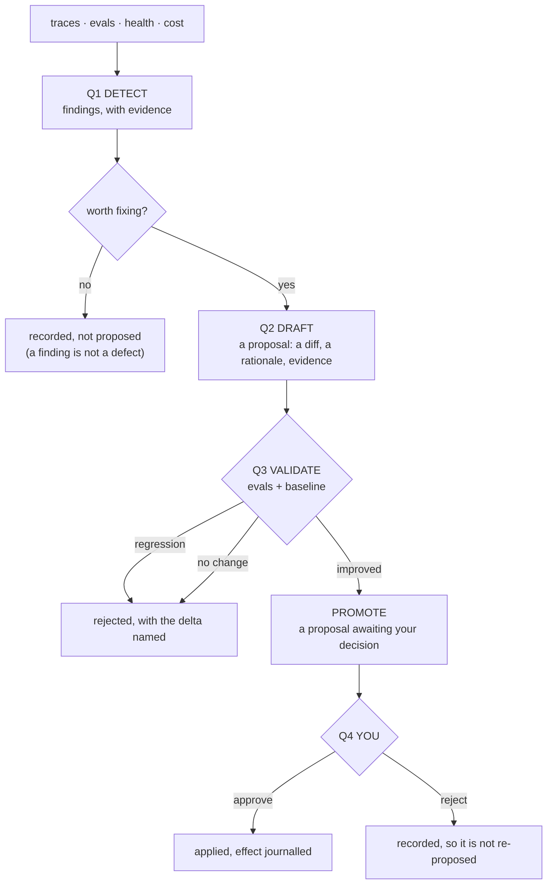

# AgentOrg — Design: The Self-Improvement Loop

How the system finds its own defects, drafts a fix, **proves the fix does not make anything
worse**, and then stops for you to decide.

This is the `trace → draft → promote` loop the master design explicitly deferred
(`DESIGN.md` §11: *"Self-improvement is deferred. Recall is context-only; there is no
trace→draft→promote loop."*). This amendment builds it — gated, never autonomous.

---

## 1. The honest framing: four questions, not one

"An agent that fixes the app itself" hides four separate problems that fail differently. Naming them
separately is what makes the work tractable and the risk legible.

| # | Question | Who can answer it | Failure if conflated |
|---|---|---|---|
| **Q1** | *Where is the defect?* | Measurement — traces, evals, health, cost | An agent "looking for bugs" invents them |
| **Q2** | *What is the fix?* | A model, given the evidence | A model editing files it does not understand |
| **Q3** | *Did the fix make it better?* | The eval suite + baseline | Improvement by vibes |
| **Q4** | *May it be applied?* | **You** | A system that rewrites its own safety net |

Q1–Q3 are engineering. **Q4 is the whole risk**, and this design answers it by refusing to: the loop
drafts and stops.

## 2. What already exists, and why that matters

Nothing here is speculative — every piece the loop needs is already built and tested:

| Piece | Where | What it contributes |
|---|---|---|
| **Behavioural suite + frozen baseline** | `engine/evals/` | A fix is *provable*, and a regression *blocks* |
| **Telemetry spans** | `engine/telemetry.py` | Per-node status, verdicts, iterations, tokens, cost, skill hash |
| **Memory with a poisoning guard** | `engine/memory.py` | What happened last time, labelled `context_only` |
| **Effect journal** | `engine/idempotency.py` | An applied proposal is not applied twice |
| **Health + SLO** | `engine/org/health.py` | Which agent is actually underperforming |
| **Cache diagnostics** | `engine/cache.py` | Whether a prompt change broke the prefix |
| **The Goal runtime** | `engine/goal.py` | The background loop that keeps working |

The gap was never *capability*. It was the **loop** and its **gate**.

## 3. The loop



Four properties, each answering a specific failure:

- **A finding is not a defect.** Q1 produces *evidence*, not opinions. `review rejected 3× on the same
  node` is a finding; "the reviewer seems weak" is not, and the detector cannot produce it.
- **A proposal is a diff plus its proof.** Nothing is applied on the strength of its description.
- **Validation is a delta, not a threshold.** The suite already works this way, and the reason is
  stated in its own docstring: a run that gains on one scenario and loses on three is a regression
  even at the same total. The loop inherits that.
- **Nothing is applied by the loop.** Not under any autonomy setting shipped here (§6).

## 4. The boundary that is not configurable

**The improver may not change the machinery that judges it.**

```
refused, always:
  engine/evals/          ← the gate that validates proposals
  engine/guardrail.py    ← the safety floor
  engine/goal.py         ← the budget/continuation runtime
  engine/config.py  (BudgetConfig, PolicyConfig, redaction)
  engine/host.py         ← supervision
  credentials.json       ← secrets
  macos/…/ConsoleAppDelegate.swift, App.swift  ← what keeps the engine alive
```

The argument is short: an improver that can edit its own eval gate can make *anything* pass. A system
whose safety property is enforced by code the system can rewrite does not have that property. So the
refusal is a **hard-coded list in the engine**, not a config knob — a setting implies a supported
alternative, and there is none.

A proposal touching a refused path is **rejected at draft time**, with the path named — not silently
dropped, because an improver that quietly discards work teaches nobody anything.

## 5. What it may propose

| Surface | Risk | Why it is safe to *propose* | Validation available |
|---|---|---|---|
| **Your own skills** (`.agentorg/skills/`) | low | Markdown + a typed contract; the pinned 327-skill library is immutable and never touched | The suite asserts a skill parses and enforces its criteria |
| **Agent roster** (bindings, model, level) | low | Reversible *data*; routing and health are already measured | Evals + `doctor` |
| **Engine behaviour** (prompt assembly, thresholds, retry, cache shape) | medium | Measurable, and the cache diagnostics catch a prefix regression | Evals + cache diagnostics |
| **App source, docs, tests** | medium | Real defects live here too | **Draft only** — the Python suite cannot validate Swift; the app build is the only check, and the loop does not run it |
| **The safety surfaces** (§4) | — | — | **Refused** |

The pinned library is worth stating explicitly: `library.verify()` hash-checks it against a commit.
Self-modifying it would break integrity, so it is refused for the same reason as §4 — not because a
skill is dangerous, but because *that* copy of it is not ours to change.

## 6. Autonomy options, and what each costs

**Shipped: Option 1.** The others are documented because the design should record *why* the line is
where it is, not merely where.

### Option 1 — Propose only *(this build)*

The loop detects, drafts, validates, and stops. You approve every change.

- **Buys:** full reversibility; nothing changes without a human read.
- **Costs:** your attention on every fix, so the loop's value is bounded by how often you look.
- **Why it is the default:** the first version of an unattended editor should be one that cannot
  edit. Every later option is a relaxation of this one, and the relaxation should be earned by
  evidence that the gate works.

### Option 2 — Auto-apply the reversible surfaces *(documented, not built)*

Applies changes to *your own skills* and *roster data* when validation passes with **no regression**,
keeping a snapshot for one-command revert. Everything else stays gated.

- **Buys:** genuinely unattended improvement of the cheap surfaces.
- **Costs:** a bad skill edit lands without review. Recoverable, because markdown and JSON are
  snapshot-revertible.
- **What it would need first:** snapshot/restore with the *same* atomicity as `state.py`'s writes, a
  revert command, and a recorded rollback that the effect journal understands. None of that exists
  yet in the engine — which is the honest reason this is not built rather than a policy preference.
  (Version control now covers the *workspace*, so a bad commit is recoverable with `git revert`; what
  is still missing is the engine's own per-proposal snapshot, which is what an unattended loop would
  need in order to undo one change without touching the rest.)

### Option 3 — Auto-apply including engine source *(documented, not recommended)*

- **Costs:** the engine *is* the enforcement. An improver editing `evals/` or `guardrail.py` is
  unguarded, and the boundary in §4 exists precisely to prevent it.
- **The environment precondition is now met, and it does not change the recommendation.** This
  workspace became a git repository after this document was first written, so a revert path now exists
  — `git checkout .` after a bad proposal, which was the missing precondition the earlier draft named.
  That removes one objection and leaves the decisive one standing: **a self-modifying agent that can
  edit its own eval gate can make anything pass.** Version control makes a bad change *recoverable*; it
  does not make the gate *trustworthy*, and the gate is what decides whether a change is bad. Revert
  protects you from the change you noticed; the boundary protects you from the change you did not.

  A revert path is necessary for Option 3 and not sufficient, which is why the boundary in §4 stays
  hard-coded whether or not the repository exists.

### Beyond these

- **A fourth surface: the eval suite itself.** The suite is the judge, so growing it is how the loop
  gets *better at judging* — but an improver that can add scenarios can add ones it already passes.
  That belongs to Option 1 with review, and it is the highest-leverage thing on this list.
- **Cross-run learning:** promoting a finding into `memory` so a future run avoids the mistake. This
  is the `trace→promote` half with no code change at all, and it is the safest next step.
- **Agent-level tuning:** per-agent model or level from its own health record. Measurable, reversible,
  and already instrumented.

## 7. Validation, and what "better" means

The loop runs the suite twice — once on the current tree, once with the proposal applied in a
**scratch copy** — and promotes only on:

1. **No regression** against the frozen baseline (`compare_to_baseline`), including *lost coverage*:
   a scenario that stopped running is a regression.
2. **A stated improvement** — the specific scenario the finding named went from failing to passing.

If it cannot show both, there is no proposal. A change that is merely *not worse* is not an
improvement, and calling it one is how a self-improving system drifts.

**Applied in a scratch copy, never in place.** The proposal carries the patch; validation applies it
to a copy so that *validating* cannot damage the working tree — the same reasoning as testing a
provider before saving it.

## 8. Failure modes designed against

| Failure | Symptom | Guard |
|---|---|---|
| **Rewriting its own gate** | Anything passes; the loop "improves" forever | §4 — a hard-coded refusal, rejected at draft time |
| **Improvement by vibes** | A change is applied because it *sounds* better | Validation is a baseline *delta*, and must name the scenario that flipped |
| **Churn** | The same fix proposed every cycle | Rejections are recorded; the effect journal stops re-application |
| **Invented defects** | A model asked to "find bugs" finds imaginary ones | Q1 is measurement, not opinion — findings carry evidence or do not exist |
| **Validation damages the tree** | Checking a fix breaks the working copy | Validation runs in a scratch copy |
| **Silent discard** | A refused proposal vanishes | Refusals are recorded *with the path named* |
| **Runaway cost** | The loop spends without bound | It runs on the Goal runtime, which is disarmed on load and budgetable |
| **A fix that helps here, hurts there** | Total improves while a scenario regresses | Delta comparison, and lost coverage counts |

## 9. What this does not do

- **It does not apply anything.** Not "by default" — at all. Option 1 is the shipped behaviour and
  the only one with code behind it.
- **It does not run the app build.** Swift changes can be drafted but not validated; a proposal
  touching `macos/` is labelled `unvalidated` rather than implied to be safe.
- **It does not touch the pinned library.** 327 skills stay immutable and hash-verified.
- **It is not a general bug-finder.** It works from evidence the engine already produces. A defect
  that leaves no trace is outside its reach, and pretending otherwise would make it a source of
  confident noise.

## 10. Open questions for review

1. **Promotion target:** an operator-editable `proposals/` directory, or a queue in the console? A
   directory is inspectable and diffable; a queue is where the Owner already looks.
2. **How much evidence is enough?** One failing scenario that flips, or a minimum number of runs
   before something counts as a pattern?
3. **Rejection memory:** should a rejected proposal be permanent, or expire? Permanent risks hiding a
   genuine fix after circumstances change; expiring risks re-litigating the same no.
