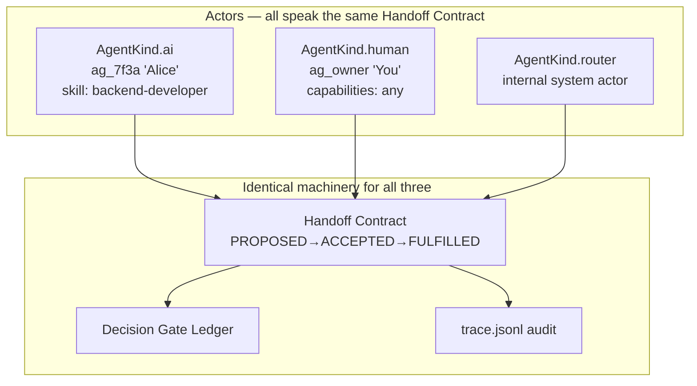
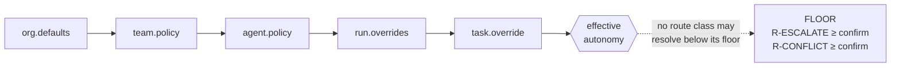
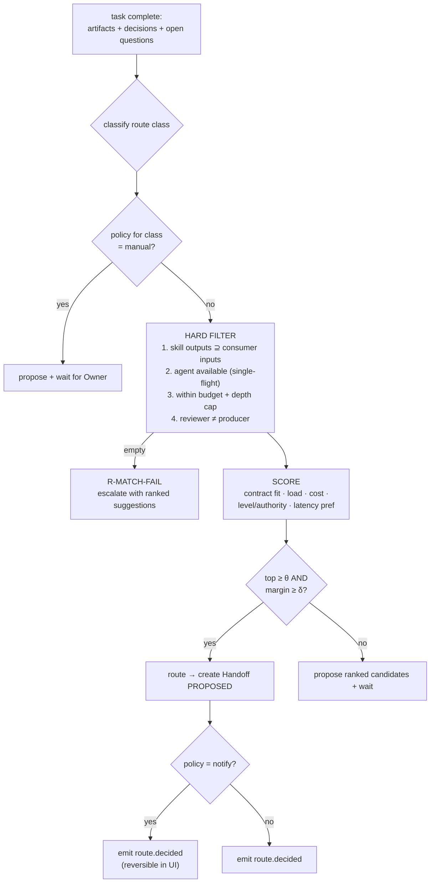
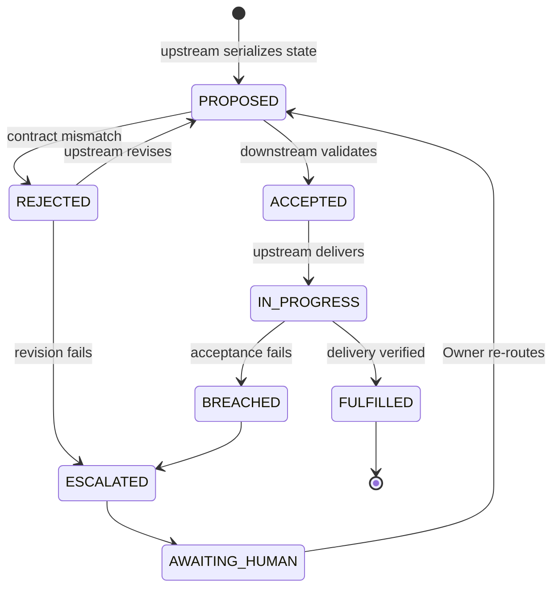
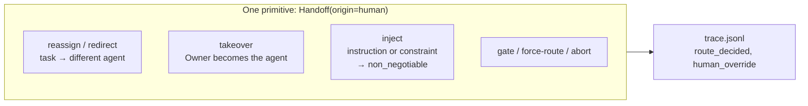

# AgentOrg — Design: Routing, Handoff & Human Control

How the system decides who does the next thing, how it hands off, and how the
Owner intervenes — autonomously or by hand.

## 1. The core unification: a human is an agent

The cleanest way to let *both* the router and the Owner move work is to make the
human a **first-class actor in the same protocol** rather than a special case.

A human handoff is literally `Handoff(origin=ag_owner, origin_kind=human, …)` —
same contract, same ledger, same checksum verification, same audit trail. A
human-initiated route is replayable from `trace.jsonl` exactly like an automated
one.

## 2. Route classes

Every next-step decision is classified before policy is applied. This is what
makes autonomy *per-route-class* rather than one global switch.

| Class | When | Library anchor | Default |
|---|---|---|---|
| `R-CONTRACT` | Phase advance, normal forward handoff | Auto-Route A1/A4 | `auto` |
| `R-REWORK` | Reviewer → Developer revision | `backend-developer` contract | `auto` (guarded) |
| `R-DELEGATE` | Agent spawns a sub-task, helper or peer | Decision Tree 4 | `auto` to depth cap |
| `R-ESCALATE` | `escalate_to`, retry exhaustion, >3 open questions, 3-failures boundary | "escalate to human or supervisor" | `confirm` |
| `R-CONFLICT` | Two agents contradict | Decision Tree 5 | `confirm` |
| `R-MATCH-FAIL` | Router finds no confident match | "No match → escalate" | `confirm` |

## 3. Autonomy resolution — layered inheritance with a hard floor

Levels: `auto` (act silently) · `notify` (act + tell the Owner) · `confirm`
(propose, wait) · `manual` (Owner must initiate).

More specific layers win, **except** the safety floor: `R-ESCALATE` and
`R-CONFLICT` cannot resolve below `confirm` unless the Owner explicitly sets
`allow_autonomous_escalation` for that agent. Without this, one careless
per-agent setting could silently disable every human gate — turning the loop
guards into decoration.

## 4. The router — confidence-thresholded

Both branches record the **same** `route.decided` event with candidates, scores,
threshold, the policy layer that decided, and any human override. That is what
makes "why did it route there?" answerable instead of mysterious.

## 5. Handoff Contract lifecycle

Mechanical rules the orchestrator cannot skip (`agent-handoff-protocol` R1–R8):

| Rule | Check | Violation |
|---|---|---|
| R1 | `token_budget_after ≤ 12,000` | re-prune; else mark handoff `blocked` |
| R2 | `non_negotiable` constraint count preserved | reject + diff constraints |
| R3 | `origin ≠ target` | abort; escalate `R-DELEGATE` |
| R4 | sha256 of received state matches recorded | reject; request re-transmission |
| R5 | irreversible decision ⇒ ledger entry exists | block handoff |
| R6 | `open_questions.length ≤ 3` | pause pipeline, `R-ESCALATE` |
| R7 | no delivery while `PROPOSED` | block delivery |
| R8 | override carries `SUPERSEDED` marker | reject override |

## 6. Interaction with the recovery loop

| Loop event | Routed as | Default resolution |
|---|---|---|
| Reviewer rejects, `attempt < 3` | `R-REWORK` | `auto` (guarded) |
| `attempt == 3` | `R-ESCALATE` | policy; floor `confirm` |
| No-progress (artifact sha unchanged) | `R-ESCALATE` | policy |
| Oscillation (a seen sha recurs) | `R-ESCALATE` | policy |
| 3 distinct approaches failed | `R-ESCALATE` with full context; do not iterate | policy |

The three loop guards (retry cap, no-progress, oscillation) all escalate through
this plane rather than talking to a human directly, so the Owner's autonomy
policy governs them uniformly.

## 7. The Owner's control surface

All four capabilities rest on one primitive, because a human is an actor (§1):

- **Reassign / redirect** — the manual form of the router's job. Creates a
  Handoff with `origin: human`; contract validation still applies.
- **Takeover** — the Owner acts as the agent, then hands back or forward. The
  task's `assigned_to` becomes `ag_owner`; the artifact records a human producer,
  which the independence check accepts.
- **Inject** — guidance or a new `non_negotiable` constraint pushed into a
  running agent's context without stopping the run. R2 then guarantees it
  survives subsequent handoffs.
- **Gate / force-route / abort** — decide `R-ESCALATE` and `R-CONFLICT`; force a
  route when `R-MATCH-FAIL` finds nothing; park or kill a run.

## 8. Ownership model

You are `AgentKind.human` with `id: ag_owner`, `role: owner` — the same
primitive as any agent, which is what lets you take over a task, hand off, and
appear in the audit trail identically to a machine actor. The `role` field
(`owner` | `reviewer`) exists now, but only `owner` is exercised; adding
Manager/Reviewer later is a permission-table change, not a re-architecture.

## 9. Events and commands

**Events:** `route.proposed` · `route.decided` · `route.overridden` ·
`handoff.proposed|accepted|rejected|fulfilled|breached` · `decision.recorded` ·
`policy.changed` · `human.gate` · `human.decision` · `human.takeover` ·
`human.released`

**Commands:** `route{force}` · `reassign{task,to}` · `takeover{task}` ·
`release{task,to?}` · `inject{task,text,as_constraint}` ·
`set_policy{scope,class,level}` · `abort{run}`

## 10. Failure modes designed against

| Failure | Symptom | Guard |
|---|---|---|
| Silent autonomy drift | Gates stop firing, nobody notices | Safety floor + `policy.changed` audit |
| Opaque routing | "Why did it go there?" unanswerable | Every decision emits candidates, scores and the deciding layer |
| Bad handoff propagates | Downstream inherits corrupt state | R1–R8 enforced mechanically |
| Unauthored human action | Owner's move looks like agent work | Human-origin handoffs carry `origin_kind` |
| Route to a busy agent | Task queues invisibly | Single-flight is a hard filter |
| No capable agent | Router silently stalls | `R-MATCH-FAIL` escalates with ranked suggestions |
| Conflict resolved silently | One agent overrides another | Ledger `SUPERSEDED` marker required (R8) |
