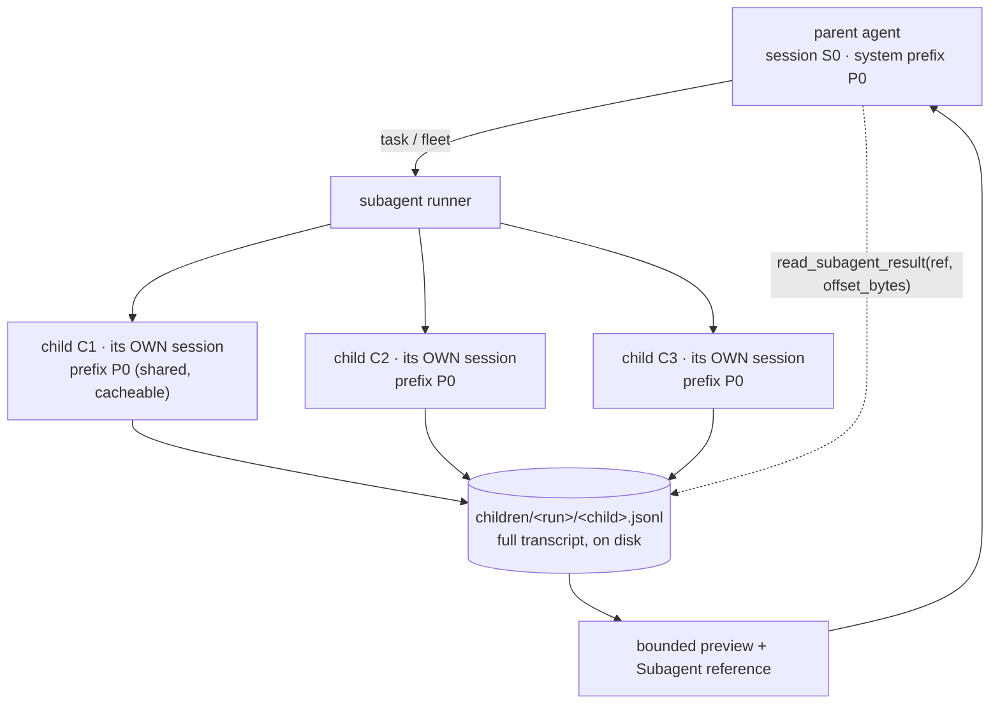

# AgentOrg — Design: Isolated Subagents

How parallel work runs in its own context and comes back as something the parent
can **page through**, rather than one string that eats its window.

Third of three amendments:

| Amendment | Question it answers |
|---|---|
| [`DESIGN-WORKSPACE.md`](DESIGN-WORKSPACE.md) | *Which folder is the code?* |
| [`DESIGN-GOAL.md`](DESIGN-GOAL.md) | *What does "keep going" mean?* |
| **DESIGN-SUBAGENTS.md** (this) | *How is parallel work isolated and read back?* |

---

## 1. The problem stated exactly

The engine already has the two swarm primitives, and they are the right ones:

- **Vote** (`BindingPolicy.SWARM`) — N agents on one question, majority decides
  (`executor._run_swarm`, capped at `swarm_max_voters` = 3).
- **Fan-out** (`fanout.py`) — `{{item}}` template × `items` list, one agent per
  item, bounded batches, order preserved in the result.

What is missing is not the *dispatch*; it is the **context boundary and read-back**:

1. **A voter/subagent's context is not isolated.** Today each runs through the same
   node machinery, so what a subagent reads lands in the parent's own accounting.
   Ten reviewers each reading twenty files is ten times the same 19KB of procedure
   and a parent window filling with transcripts it never asked to keep.
2. **There is no child transcript to read back.** Fan-out returns results *in
   aggregate*. If one item's result is a 4,000-line finding and the parent needs
   line 900, it either takes all of it or none.
3. **A child is not resumable.** Fan-out is one-shot per node. A subagent that stops
   at `needs_review` cannot be continued; the parent re-runs it from scratch.

Kimi's `task` / `fleet` answer exactly these: isolated contexts, persisted child
transcripts, and `read_subagent_result` with `offset_bytes` paging. This amendment
brings the same shape to the primitives already here.

## 2. A subagent is a session, not a node

The unit of isolation is the **session** — the bounded context window that
`engine/context/session.py` already owns — not a new concept.



Four properties, each with a reason:

- **The child gets its own session**, so its reads and reasoning do not accumulate
  in the parent's window. The parent's context stays about *the work*, not about
  *how each helper found out*.
- **The child shares the parent's pinned prefix.** Isolation is the *log*, not the
  *prefix*. `prefix.py` already makes the cacheable bytes `(skill, tools)`-scoped
  and agent-independent; a child that re-derived a different prefix would pay full
  price for the same procedure and break the one invariant this codebase treats as
  load-bearing. **Identity and the task go in the tail**, never the prefix — the
  documented mistake that cost 58% on every swarm.
- **The transcript is durable and separate.** `children/<run_id>/<child_id>.jsonl`,
  append-only, never re-sent to a model whole.
- **What the parent sees is a preview plus a reference**, not the transcript.

This is the same append-only, cache-first discipline as `prefix.py`'s three
regions, applied one level down.

## 3. The reference and paging

The parent receives, per child, a bounded frame:

```jsonc
{
  "child_id": "sub_4a1b",
  "agent_id": "ag_9c1d",
  "skill": "code-reviewer",
  "status": "done",                 // done | needs_review | failed
  "steps": 7,
  "tokens_in": 18422, "tokens_out": 903,
  "preview": "…first 1,200 bytes…",
  "transcript": "children/run_…/sub_4a1b.jsonl",
  "bytes": 41930,                   // full size, for paging arithmetic
  "preview_bytes": 1200
}
```

and one new tool reads it back:

| Tool | Behaviour |
|---|---|
| `read_subagent_result(ref, offset_bytes=0, limit_bytes=8192)` | Returns a **byte range** of the child transcript, clamped and honest about truncation |

Design rules for the tool, all mirroring Reasonix's pruning discipline:

- **Bounded by construction.** Default `limit_bytes` 8192, capped; a caller cannot
  ask for a 40MB transcript and silently blow its own window.
- **Byte-addressed, not line-addressed.** Offsets are stable across runs and
  re-reads; line numbers are not once a transcript is appended to.
- **Truncation is reported** — `returned_bytes`, `total_bytes`, `more: true/false`
  — so the model can page deliberately instead of assuming it saw everything. A
  silent truncation is the confident-wrong-output failure the eval suite exists to
  catch.
- **Reading is cheap and read-only**, and it lands in the parent's log, so the
  parent pays for exactly the slice it asked for.

## 4. Dispatch: `task` and `fleet`

Two tools on an agent, the two shapes Kimi uses:

| Tool | Shape | Maps onto |
|---|---|---|
| `task(child)` | one subagent, one question, isolated context | a **single-voter** swarm; the delegation path in `org/delegation.py` |
| `fleet(tasks[])` | N subagents in parallel, each read-only by policy | existing **fan-out** batching (`max_parallel`) |

They reuse what exists rather than duplicating it:

- **Batching and the parallel cap** come from `fanout.plan.batches(max_parallel)`.
  No new scheduler.
- **Budget partitioning** comes from the delegation design: a child's budget is
  carved from the parent's, so a fleet cannot spend past its parent.
- **Depth** is capped by `max_subagent_depth` (default 2: root = 0, first layer = 1).
  A child does not receive recursive agent/skill tools at the final layer, which is
  what stops unbounded recursion.
- **Read-only by default for `fleet`**, matching the delegation ladder: research
  fans out freely, writes do not. A `fleet` that must write is a fan-out node, which
  already exists and is already bounded.

## 5. Why this does not become a cost explosion

Isolation and paging are exactly what keep a wide fan-out affordable:

| Without isolation | With isolation |
|---|---|
| N children's content in the parent window | parent keeps N previews ≈ N × 1.2KB |
| parent re-reads 19KB procedure per child | prefix shared, cached, paid once per `(skill, tools)` |
| "read the whole result" or nothing | page the 8KB you need |
| re-run a stopped child from scratch | resume from its transcript |

The measured property `DESIGN-CONTEXT.md` and `prefix.py` already assert holds here
too: the cost of a fan-out is dominated by the **prefix**, which isolation
*reduces*, not by N.

## 6. Relation to what exists

This amendment **upgrades** the swarm primitives; it does not replace them.

| Existing | Becomes |
|---|---|
| `_run_swarm` (vote) | unchanged for aggregation; each voter gains an isolated session + transcript |
| `fanout.py` (throughput) | unchanged for dispatch; each item gains a transcript + reference |
| `org/delegation.py` (hiring) | the durable/privileged path; `task` is the *ephemeral* helper it already models |
| `context/session.py` | the isolation unit — reused, not reinvented |
| `prefix.py` / `pinning.py` | the shared prefix — the reason a fleet stays cacheable |

A `task` is therefore **a Helper in the delegation taxonomy** — ephemeral, dies with
the node, auto-approvable within limits — and this amendment gives that Helper the
context boundary it was missing.

## 7. Persistence and lifecycle

```
<workspace>/.agent_state/
  children/
    <run_id>/
      <child_id>.jsonl     # append-only: open, turn, turn, …, status
      <child_id>.meta.json # the reference frame (atomic, schema-versioned)
```

- **Sessions are archived, never re-sent** — the rule `Session.archive()` already
  enforces, applied to children.
- **A completed child's transcript is retained** for the run, so `read_subagent_result`
  works after the parent has moved on.
- **A stopped child is resumable**: `needs_review` keeps its transcript and its
  session id, so a continuation appends rather than restarts. This is the fan-out
  analogue of `run_state.json`'s resume.
- **Pruning is a deliberate cache-reset point**, as in `DESIGN-CONTEXT.md`: a child
  transcript is only rewritten (pruned) at maintenance, never mid-turn.

## 8. Protocol surface

New events (mirrored in Swift's `EventType`):

| Event | Meaning |
|---|---|
| `subagent.spawned` | child id, parent, skill, depth |
| `subagent.progress` | quiet round boundary per child |
| `subagent.done` / `subagent.failed` | with the reference frame |
| `subagent.read` | a `read_subagent_result` call, with the byte range |

The **Work** tab gains a subagent tree under the running node — "the run, its gates,
and any swarm in flight" already promised by that panel; this makes the swarm
*readable* rather than a single aggregate line.

## 9. Failure modes designed against

| Failure | Symptom | Guard |
|---|---|---|
| Parent window blown by children | Context overflow mid-fan-out | Child = own session; parent sees previews |
| Cache destroyed by isolation | Fleet pays N × full prefix | Prefix is shared and pinned; identity/task in tail |
| Runaway recursion | child spawns child spawns child | `max_subagent_depth`; no recursive agent tools at the final layer |
| Unbounded cost per fleet | 40 children × unbounded steps | Parent-carved budget + `max_parallel` batches + `max_steps` |
| Silent truncation | Parent assumes it saw the whole result | `returned_bytes`/`total_bytes`/`more` on every read |
| Orphaned transcripts | Disk fills, nothing reads them | Per-run directory; archived with the run; size in `Workspace.size_bytes` |
| Write race from helpers | Two children edit one file | `fleet` is read-only; writers are fan-out **nodes**, which serialise via `PathLock` |
| Duplicate fan-out work | Two children on the same item | `fanout.plan` already refuses colliding expanded prompts |

## 10. Trade-offs

- **More moving parts.** A subagent is now a session + a transcript + a reference,
  where it was a call. The payoff is a readable, resumable, cache-clean fan-out; the
  cost is more state to keep consistent. The mitigation is that every piece is
  reused (`Session`, `ArtifactStore` atomicity, `fanout` batching, `PathLock`) rather
  than new.
- **Isolation hides work.** A child's reasoning is out of the parent's context, so
  the parent can be wrong about what a child did. That is why the reference carries
  `status`, `steps` and token counts — enough for the parent to know *whether* to
  page, and `read_subagent_result` to find out *what*.
- **Byte-paging is a UI for the model.** Paging is a capability the model must use
  correctly; a model that never pages sees only 1.2KB previews. Mitigated by making
  the preview a *summary* the child writes (its `LoopOutcome.text`), not an arbitrary
  byte slice — so the default view is meaningful even without paging.

## 11. What was built, and the choices made

The open questions above were **decided and implemented**:

1. **JSONL transcripts**, matching `trace.jsonl` and the event stream, so one reader understands both
   and a person debugging a run is not learning a second format.
2. **A fixed 1 200-byte preview**, and it is the child's *own summary* rather than an arbitrary byte
   slice — so the default view is meaningful even when the model never pages.
3. **Resuming a child reuses its transcript**; `resumable()` is true only for a child that reached a
   verdict of its own (`needs_review`). A child that crashed outright is re-run, because appending to a
   partial turn builds on a half-thought.
4. **`task` is available to every agent**; `fleet` (the N-at-once shape) is behind
   `executor.subagent_fleet_enabled`, and both are behind `executor.subagents_enabled`. Dispatch
   multiplies cost, so it is opt-in rather than incidental — the same reasoning as `read_only`.

One bound the design stated and the implementation enforces on the *child* rather than at dispatch:
`MAX_SUBAGENT_DEPTH` is checked in `ChildStore.open`, so any caller inherits it, not just the tool that
happened to request the work.

Shipped as:

| Surface | Where |
|---|---|
| `ChildStore`, `ChildRef`, `ChildPage`, `SubagentRunner` | `engine/subagents.py` |
| `task` / `fleet` / `read_subagent_result` tools | `engine/tools.py` |
| Per-child `Session` sharing the parent prefix | `engine/executor.py` |
| `executor.subagents_enabled` / `subagent_fleet_enabled` | `engine/config.py` |
| `subagents` / `subagent_result` commands | `engine/protocol.py`, `engine/serve.py` |
| Subagent tree + paged transcript viewer | `Panels.swift`, `OrgController.swift` |
| Contract fixture covering the events | `macos/Tests/.../Fixtures/record-engine-trace.py` |
