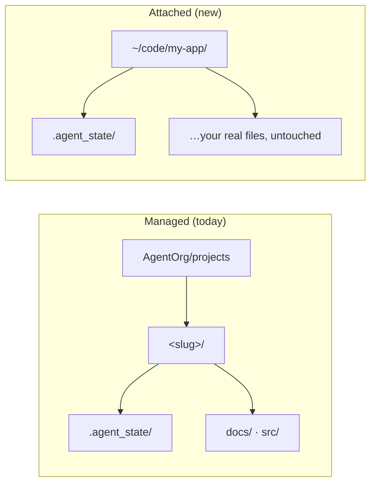

# AgentOrg — Design: Workspace Attachment

How the engine is pointed at **your** project folder — the one you already have —
instead of at a directory the engine creates.

This is the first of three amendments that together make AgentOrg behave like a
coding agent you *leave running on a real repository*:

| Amendment | Question it answers |
|---|---|
| **DESIGN-WORKSPACE.md** (this) | *Which folder is the code?* |
| [`DESIGN-GOAL.md`](DESIGN-GOAL.md) | *What does "keep going" mean?* |
| [`DESIGN-SUBAGENTS.md`](DESIGN-SUBAGENTS.md) | *How is parallel work isolated and read back?* |

---

## 1. The problem stated exactly

Today a workspace is **managed**: `Workspace(slug, root)` and

```
path      = root / slug            # AgentOrg/projects/<slug>
state_dir = path / ".agent_state"
```

`root` defaults to `AgentOrg/projects`, `_SLUG_RE` requires
`[a-z0-9][a-z0-9._-]*`, and `ensure()` creates `path`, `.agent_state/`, `docs/`,
`src/`, and the per-agent/session/telemetry directories.

Three consequences follow, and all three are wrong for a real repository:

1. **The agents' file tools are rooted at `projects/<slug>`.** The executor builds
   `ToolRegistry(workspace_root=self.ctx.workspace, ...)` and the store is
   `ArtifactStore(workspace_root=workspace.path)`. So "add a field to `User.swift`"
   edits `projects/<slug>/src/User.swift`, never your `User.swift`.
2. **`ensure()` would create `docs/` and `src/` inside your repo.** Empty ones, if
   your project has neither — a Go or Rust project would gain directories it never
   asked for.
3. **The slug is validated as an identifier, but a directory name is not one.**
   `My_App`, `Foo.Bar`, `web-app-2` are ordinary folder names and `My_App` fails
   `_SLUG_RE`.

## 2. The one decision: the folder *is* the workspace

Two layouts, one object. Attachment changes **where `path` points**; it does not
introduce a second state format.



- **Managed** keeps every existing promise; nothing about it changes.
- **Attached** sets `path = <your folder>` and `state_dir = <folder>/.agent_state`.
  The agents read and write your real tree, because every containment check already
  resolves against `workspace_root` — the seam was built for this and only the
  value fed to it was pinned to `projects/`.

`.agent_state/` is reused **verbatim** rather than renamed. The checkpoint, trace,
org, effect journal, telemetry, sessions and the run-context handoff all already
live there and are already named in exactly one place (`state.py`); a second name
would give the Swift inspector and the diagnostics bundle a second layout to drift
from.

## 3. The object

```python
@dataclass
class Workspace:
    slug: str
    root: Path
    attached: Path | None = None     # set iff this workspace is an existing folder

    @property
    def path(self) -> Path:
        return self.attached if self.attached is not None else self.root / self.slug

    @property
    def is_attached(self) -> bool:
        return self.attached is not None
```

`attach()` is the only new constructor:

```python
ws = Workspace.attach("~/code/my-app")   # expanduser + resolve; must exist and be a dir
```

Rules it enforces, each because the alternative is a silent wrong directory:

| Rule | Why |
|---|---|
| The path must **exist and be a directory** | A typo would otherwise create a project somewhere unintended |
| The path is `resolve()`d, symlinks followed | Containment is decided on the resolved path; attaching a symlink must mean the target |
| `slug` is **derived** from the folder name and normalised to `_SLUG_RE` | Keeps identifiers valid (`My_App` → `my_app`) without rejecting real folder names |
| `display_name` keeps the **original** folder name | The console shows `My_App`, not the normalised slug |
| Attaching a directory that is **already a workspace** is idempotent | Re-opening a project is not an error, as today |

The real directory is stored, not reconstructed from `root`/`slug`. Deriving the
path back from a normalised slug would lose case and separators and land somewhere
else entirely — the exact class of bug `state.py` exists to prevent.

## 4. What `ensure()` may create

This is where attached mode earns its own branch:

| Directory | Managed | Attached |
|---|---|---|
| `path` | create | **already exists — never created** |
| `.agent_state/` + subdirs | create | create |
| `docs/` | create | **never** |
| `src/` | create | **never** |
| `agents/` `sessions/` `telemetry/` (under `.agent_state/`) | create | create |

An attach that created `src/` in a Go project would be a visible, wrong mutation of
your repository — from a read-only inspection command. Anything outside
`.agent_state/` is created only when it already belongs to the layout the engine
owns.

## 5. Containment, re-examined

Pointing `workspace_root` at a real repository widens what the agents can reach, so
two rules are added rather than assumed:

- **`.agent_state/` is invisible to agent file tools.** `ArtifactStore.list_files`
  already excludes secrets; it gains `.agent_state/` for the same reason — an agent
  that can read or rewrite its own checkpoint can fabricate a resume, and one that
  can delete `effects.jsonl` can defeat idempotency. The engine's state is not
  project content.
- **`.git/` is read-only to agents.** A `git` *tool* may run commands; a *file*
  write into `.git/` is refused. History is the one part of a repository that
  cannot be re-derived, and a bad ref write is not a checkpoint you can resume from.

Capability grants are unchanged and still prefix-scoped (`read:src/` grants
`read:src/app.py`), so the least-privilege model that `tools.py` already enforces
applies to your real tree exactly as it applied to the managed one.

## 6. Where the flag goes

One new argument, `--project <dir>`, on every command that resolves a workspace.
`--root` keeps its meaning (the *projects root* for managed mode); `--project` wins
when both are given, because naming a folder is more specific than naming a
directory of folders.

```bash
engine.cli run     --project ~/code/my-app --goal "add pagination to the list endpoint"
engine.cli status  --project ~/code/my-app
engine.cli decide  --project ~/code/my-app --approve
engine.cli chat    --project ~/code/my-app
engine.cli serve   --project ~/code/my-app      # what the macOS app launches
```

Commands affected: `run`, `status`, `decide`, `instruct`, `chat`, `serve`,
`fanout`, `pool *`, `org`, `plan`. Each routes through `_orchestrator` /
`_project_root`, which resolve the workspace in one place — so one change reaches
every command rather than eleven.

Resolution order, stated once:

```
--project <dir>      → Workspace.attach(dir)
--root <dir> --slug  → Workspace(slug, root)
neither              → Workspace(slug, AgentOrg/projects)
```

## 7. The macOS app

The app currently hardcodes `project = AgentOrg/projects/demo` and has no way to
change it. Attachment is the feature that makes the console useful on a real
project, so it needs a picker and a relaunch:

```mermaid
sequenceDiagram
  participant U as User
  participant App as AgentOrg (SwiftUI)
  participant Eng as engine.cli serve
  U->>App: File ▸ Open Project… (⇧⌘O)
  App->>App: NSOpenPanel (canChooseDirectories, no files)
  App->>App: writer.root = chosen dir; projectPath = chosen dir
  App->>Eng: stop (checkpoint) → relaunch with --project <dir>
  Eng-->>App: run.start … (same NDJSON stream)
```

- `OrgSettings.projectPath` becomes **mutable**, and `OrgController` gains
  `setProject(_:)` which stops the engine (checkpointing first), swaps
  `WorkspaceWriter.root`, and relaunches with `--project`.
- The **Resources** panel already renders `controller.projectPath`; the **Org**
  panel gains `attached: yes/no` so it is unambiguous whether the agents are in your
  tree or a managed one.
- A relaunch rather than a live re-root: the executor holds the workspace path in
  its subprocess, and mutating it underneath a running graph is how a run writes
  half its artifacts into the previous project. Stopping at a checkpoint is the
  same mechanism `pause`/`resume` already uses.

## 8. Failure modes designed against

| Failure | Symptom | Guard |
|---|---|---|
| Attach typo creates a project | A new directory appears next to the one you meant | Path must exist and be a directory; `resolve()` before any write |
| Slug normalisation loses the folder | State written to `projects/my_app` instead of `~/code/My_App` | The real path is stored on the object; never re-derived from the slug |
| Engine state treated as project content | Agent edits its own checkpoint / effects journal | `.agent_state/` excluded from agent file tools |
| History corrupted by an agent | A ref write breaks `.git` | `.git/` refused for file writes |
| `ensure()` mutates a real repo | Empty `src/` appears in a Go project | Attached mode creates only `.agent_state/` and below |
| Re-root under a running graph | Half a run's artifacts in the old project | Project change stops at a checkpoint, then relaunches |
| Two projects, one slug | Ambiguous workspace | Slug is display-only in attached mode; state is per-folder |

## 9. Trade-offs

- **The state directory lives in your repository.** `<folder>/.agent_state/` is
  inspectable and travels with the project, which is the point — but it must be
  gitignored, or a commit carries run traces. The engine **suggests** the entry
  (`agentorg doctor` reports it missing) and never edits your `.gitignore`.
- **Widened blast radius is real.** A managed workspace bounded the damage at
  `projects/<slug>`. Attachment deliberately removes that bound. What replaces it is
  the capability gate, `read_only` runs, the effect journal and the approval gate —
  all of which already exist — plus the two new exclusions above. This trade-off is
  the reason attachment is explicit (`--project`) and never inferred.
- **`--root` and `--project` both existing** is one flag more than the ideal. The
  alternative — overloading `--root` to mean "the project" in one mode and "the
  projects directory" in another — makes one flag mean two things depending on
  context, which is the mistake this design avoids elsewhere.

## 10. What was built, and the choices made

The three open questions above were **decided and implemented**:

1. **`.gitignore` is report-only.** `doctor` reports the missing entry; the engine never edits your
   file. The alternative — offering to append it — puts a write to an unreviewed file behind a
   confirmation nobody reads twice.
2. **Attachment is whole-repository only.** A subdirectory root would silently change what
   `src/app.py` means, because `path` is also where artifacts resolve. A monorepo package is not
   attachable yet, and that is stated rather than half-supported.
3. **An existing `.agent_state/` is resumed.** Refusing would make a re-opened project unusable for
   no reason; the goal inside it still comes back disarmed (see `DESIGN-GOAL.md`), so resuming state
   never resumes *spending*.

Shipped as:

| Surface | Where |
|---|---|
| `Workspace.attach()` / `is_attached` / `display_name` | `engine/state.py` |
| Attached-safe `ensure()` (never creates `docs/`/`src/`) | `engine/state.py` |
| `.agent_state/` invisible to tools, `.git/` writes refused | `engine/tools.py`, `engine/artifacts.py` |
| `--project` on every workspace command; `--slug` optional with it | `engine/cli.py` |
| `serve(project_dir=…)` + `workspace` in every snapshot | `engine/serve.py` |
| `--project` launch plumbing | `AgentProcessService.swift` |
| Open Project picker (toolbar + ⌘O), checkpointed relaunch | `ConsoleView.swift`, `App.swift`, `OrgController.swift` |
