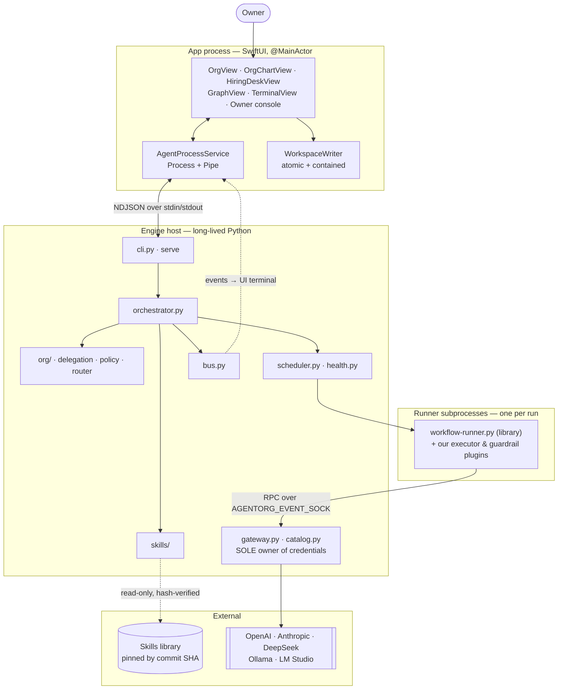
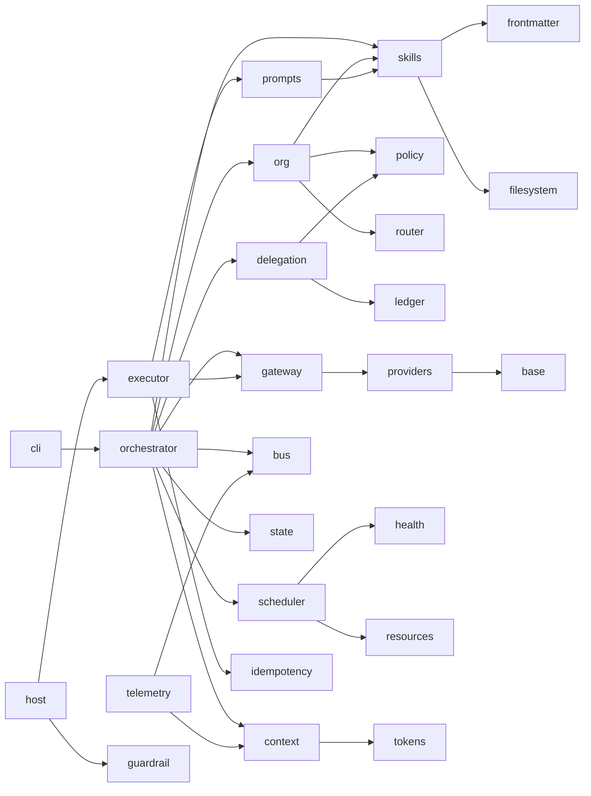
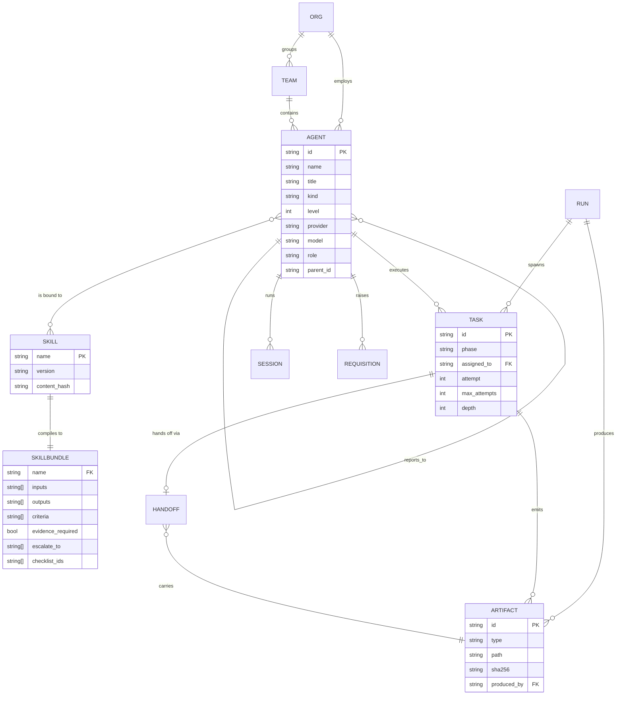
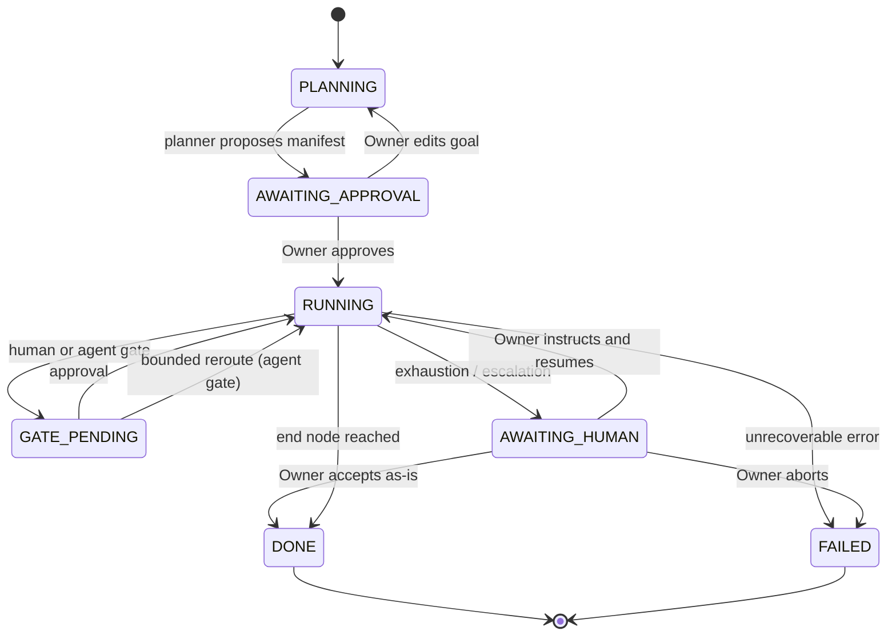

# AgentOrg — Design

A native macOS application that runs a **model-agnostic, multi-agent software
engineering organization**. The owner hires named agents, binds each to a skill
from the [`zeroes-ones/Skills`](https://github.com/zeroes-ones/Skills) library,
and points them at a project. Agents work together through typed handoffs,
loops, graphs and gates until the work is done.

Ten focused amendments cover subsystems in depth. The first seven are the original
build; the last three are **implemented** and make AgentOrg run as a coding agent
you leave running on a real repository — attach your own folder, keep going until
the goal is done, and fan out over isolated, resumable subagents.

| Document | Covers |
|---|---|
| [`DESIGN-GRAPH.md`](DESIGN-GRAPH.md) | Manifests, loops, arbitrary-direction handoffs, termination |
| [`DESIGN-ROUTING.md`](DESIGN-ROUTING.md) | Route classes, autonomy policy, handoff contracts, human control |
| [`DESIGN-CONTEXT.md`](DESIGN-CONTEXT.md) | Session lifecycle, saturation, compaction, rotation |
| [`DESIGN-CONCURRENCY.md`](DESIGN-CONCURRENCY.md) | Process topology, scheduling, resource governance |
| [`DESIGN-HEALTH.md`](DESIGN-HEALTH.md) | Model catalog, ownership, agent health, observability |
| [`DESIGN-DELEGATION.md`](DESIGN-DELEGATION.md) | Agents hiring agents, requisitions, invariants |
| [`DESIGN-HARDENING.md`](DESIGN-HARDENING.md) | Evals, idempotency, cost correctness, supply chain, accessibility |

Three further amendments make AgentOrg usable as a coding agent left running on a
real repository. All three are **implemented and tested**:

| Amendment | Covers |
|---|---|
| [`DESIGN-WORKSPACE.md`](DESIGN-WORKSPACE.md) | Attaching an existing project folder as the workspace |
| [`DESIGN-GOAL.md`](DESIGN-GOAL.md) | The durable, resumable Goal runtime ("leave it running") |
| [`DESIGN-SUBAGENTS.md`](DESIGN-SUBAGENTS.md) | Isolated-context subagents with paged, resumable transcripts |

One further amendment is **designed and partly implemented**: the self-improvement loop. It is
propose-only — it detects its own defects, drafts fixes, proves them against the eval baseline, and
stops for the Owner. It never applies anything.

| Amendment | Status |
|---|---|
| [`DESIGN-IMPROVER.md`](DESIGN-IMPROVER.md) | The `trace → draft → promote` loop. Detection, drafting, validation and the console panel are **built**; autonomy options 2 and 3 are **documented, not built**, with the reasons. |

---

## 1. The one idea everything derives from

| Concept | Is | Identity | Owner |
|---|---|---|---|
| **Skill** | A SOP — markdown plus a typed contract | `code-reviewer` | The Skills library (immutable) |
| **Agent** | An *employee*: a named instance bound to skills + a model | `ag_7f3a` / "Sana" | The Owner |
| **Team** | A group with a lead | "Platform" | The Owner |
| **Org** | Roster + reporting lines + topology | the company | The Owner |
| **Task** | One unit of work routed to one agent | `task_014` | The orchestrator |
| **Artifact** | A typed, hashed file produced by a task | `prd` / `change` / `review` | The producer |
| **Handoff** | A contract-checked artifact transfer | `ag_3b1c → ag_9c1d` | The orchestrator |
| **Run** | One project execution | `run_20261115…` | The engine |

A skill is **capability**; an agent is **headcount**. The same skill can exist
many times under different names with different models — `backend-developer` as
Alice (local Ollama), Bob (Anthropic) and Chen (OpenAI) — each with its own
mailbox, budget, session history and health record.

## 2. Layered architecture — five rings, dependencies point down

```
┌───────────────────────────────────────────────────────────────┐
│ RING 5 · NATIVE SHELL          SwiftUI + Process/Pipe bridge   │
│   knows: NDJSON events.  knows nothing about: prompts, HTTP    │
├───────────────────────────────────────────────────────────────┤
│ RING 4 · GATEWAY               adapters, routing, retries      │
│   knows: HTTP wire formats.  knows nothing about: phases       │
├───────────────────────────────────────────────────────────────┤
│ RING 3 · ORCHESTRATION         state machine, loops, gates     │
│   knows: tasks, artifacts, contracts.  owns: control flow      │
├───────────────────────────────────────────────────────────────┤
│ RING 2 · ORG MODEL             agents, teams, topology, budget │
│   knows: who exists, who reports to whom, who may do what      │
├───────────────────────────────────────────────────────────────┤
│ RING 1 · LIBRARY ADAPTER       SKILL.md → SkillBundle          │
│   knows: the library's frontmatter + checklist grammar         │
└───────────────────────────────────────────────────────────────┘
   cross-cutting ── protocol · bus · state · secrets · budget
```

The discipline is what makes the system testable: the recovery loop (Ring 3) is
verifiable with zero network and zero Swift, because Ring 4 sits behind the
`Provider` ABC and Ring 5 behind the event stream.

## 3. System context



## 4. Module map



`prompts.py` depends on `skills.py` (it needs the checklist IDs) but **not** on
the gateway — prompts are pure data, which is what makes them snapshot-testable.

## 5. Repository layout

```
AgentOrg/
├── DESIGN*.md                     design documents (this set)
├── credentials.example.json       committed template
├── credentials.json               gitignored, 0600
├── engine/
│   ├── cli.py  __main__.py        run | serve | resume | status | org | models
│   ├── config.py                  env interpolation, validation, redactor, leak scan
│   ├── library.py                 pin + hash-verify the Skills library
│   ├── protocol.py                ★ NDJSON event/command schema
│   ├── bus.py                     thread-safe EventBus + ring buffer + JSONL sink
│   ├── state.py  artifacts.py     checkpoints, atomic writes, sha256, path locks
│   ├── versioning.py              schema versions + migration + refusal
│   ├── idempotency.py             effect journal (exactly-once side effects)
│   ├── resources.py               CPU/memory/thermal detection → ceiling
│   ├── tokens.py                  estimator + calibration + per-model windows
│   ├── gateway.py                 ★ model-agnostic dispatcher
│   ├── catalog.py                 live provider model discovery
│   ├── rpc.py                     gateway-as-a-service over the event socket
│   ├── skills/                    source | filesystem | mcp | frontmatter | bundle
│   ├── prompts.py                 checklist-enforcing prompt builder
│   ├── planner.py                 goal → validated manifest for approval
│   ├── providers/                 base | openai | anthropic | ollama | fake | registry
│   ├── org/                       agent | roster | binding | policy | handoff
│   │                              ledger | router | mailbox
│   ├── delegation.py              ladder · requisition · approval tiers · S1–S6
│   ├── scheduler.py               admission control, semaphores, watchdog
│   ├── health.py  slo.py          golden signals, health states, error budgets
│   ├── context/                   session | projection | compaction
│   │                              rotation | assembly
│   ├── memory.py                  run-memory write/recall + poisoning guard
│   ├── telemetry.py               OTel-shaped spans + SLI rollup
│   ├── diagnostics.py             correlation logging, health endpoint, bundle
│   ├── executor.py                ★ execute_node(node_id, state, ctx)
│   ├── guardrail.py               classify(node_id, result, state)
│   ├── host.py                    runner subprocess supervision
│   └── orchestrator.py            ★ lifecycle, gates, owner commands, resume
├── macos/
│   ├── Package.swift
│   ├── Sources/AgentOrgKit/       AgentProcessService.swift · PythonRuntime.swift
│   │                              ProtocolModels.swift · LogStore.swift
│   │                              WorkspaceWriter.swift · OrgController.swift
│   ├── Sources/AgentOrg/          App.swift + views
│   └── Tests/AgentOrgKitTests/
├── evals/                         behavioral suite + frozen baseline
└── tests/
```

★ marks the three deliverables named in the original brief.

## 6. Domain model



The `AGENT }o--o{ SKILL` many-to-many with a **surrogate `id`** is the
schema-level expression of "same skill, many named agents." `AGENT.kind`
(`helper` | `specialist` | `twin`) and `AGENT.parent_id` carry delegation
lineage.

## 7. The run lifecycle



Phase ordering inside a manifest is **not** hardcoded. The planner authors the
graph from the goal and the skills' own contracts; the Owner approves it before
anything runs. Every transition is guarded by the producing skill's
`workflow.completion.criteria` and `evidence: required`.

## 8. The IPC protocol — the load-bearing seam

`stdout` carries **NDJSON events only**. Every diagnostic goes to `stderr`.
`stdin` carries NDJSON commands. This lets the Swift layer and the Python engine
be built and tested independently.

```json
{"v":1,"seq":42,"ts":"2026-11-15T10:04:12Z","run_id":"run_…",
 "type":"agent.log","agent_id":"ag_7f3a","phase":"DEVELOP",
 "payload":{"stream":"reasoning","text":"…"}}
```

| Group | Events |
|---|---|
| Run | `run.start` · `run.queued` · `run.admitted` · `run.end` · `run.paused` · `run.aborted` |
| Graph | `manifest.proposed` · `manifest.approved` · `node.enter` · `node.exit` · `loop.pass` · `loop.stagnation` · `handoff.verified` |
| Agent | `agent.spawn` · `agent.status` · `agent.log` · `agent.spawn.requested` · `agent.spawn.approved` · `agent.spawn.denied` · `agent.spawned` · `agent.destroyed` · `agent.retirement_review` |
| Model | `llm.request` · `llm.response` · `model.catalog.refreshed` |
| Work | `artifact.written` · `checklist.result` · `review.rejected` · `review.approved` · `run.criteria.satisfied` |
| Routing | `route.proposed` · `route.decided` · `route.overridden` · `handoff.proposed` · `handoff.accepted` · `handoff.rejected` · `handoff.fulfilled` · `handoff.breached` |
| Context | `session.open` · `session.saturation` · `session.compact` · `session.rotate.requested` · `session.sealed` · `session.handoff.verified` · `session.closed` · `context.irreducible_overflow` · `attention.decay` |
| Health | `agent.health.changed` · `agent.slo.breach` · `agent.quarantined` · `agent.recovered` · `agent.sprawl.suspected` |
| Control | `human.gate` · `human.decision` · `policy.changed` · `human.takeover` · `human.released` |
| Ops | `backpressure.on` · `backpressure.off` · `cost.ceiling` · `cost.reconciled` · `budget.burn` · `watchdog.restart` · `delegation.rejected` · `schema.migrated` · `schema.refused` · `effect.applied` · `effect.replayed` · `leak.detected` · `span.exported` · `diagnostics.exported` · `error` |

Commands: `start` · `pause` · `resume` · `approve` · `reject` · `instruct` ·
`assign` · `spawn_agent` · `rename_agent` · `reassign` · `takeover` · `release` ·
`inject` · `route{force}` · `set_policy` · `retire` · `quarantine` · `restore` ·
`abort` · `snapshot` · `shutdown`. Each carries a `cmd_id`; the engine replies
`command.ack{cmd_id, ok, error?}`.

## 9. Build and run

```bash
# Engine
cd AgentOrg
python3 -m engine.cli --help
python3 -m pytest tests/ -q

# App
cd AgentOrg/macos
swift build
swift test
open Package.swift          # Xcode
```

## 10. Design decisions and trade-offs

| Decision | Chosen | Rejected | Why |
|---|---|---|---|
| Graph control flow | Reuse the library's `workflow-runner.py` | Reimplement | Its cycle rejection, budgets, stagnation detection and handoff-hash verification are already self-tested; we write plugins, not an engine |
| Anthropic | Native `/v1/messages` adapter | OpenAI-shaped proxy | Usage data feeds the cost ceiling; a proxy hides it and adds a moving part |
| Concurrency | Threads, not asyncio | asyncio | Work is I/O-bound (inference happens in the provider); blocking adapters keep the subprocess lifecycle simple |
| Where agents run | Engine host + runner subprocesses | In the app process | The app can never hang on agent work |
| Skill source | Filesystem primary, pinned by SHA | MCP-only | Offline, fast, tamper-evident; MCP stays available but off by default |
| Context | Compiled XML preferred | Raw `SKILL.md` | ~2.2k vs ~18k tokens per skill |
| Reviewer identity | Must differ from producer | Any agent | Required by `verification-independence-engineer` |
| Autonomy | Gated, layered, with a safety floor | Full auto | Every skill declares `escalate_to: [human-gate]` |
| Loop guards | Depth + no-progress + oscillation + budget | Retry counter only | A counter alone spins to exhaustion on identical output |
| Delegation | Reuse-first ladder, depth ≤ 3 | Spawn on demand | Hallucination compounds 15–20% per hop; token-per-task leaks silently |
| Code execution | Written, not executed (v1) | Run produced code | Execution needs a real sandbox boundary — its own phase, not a silent omission |
| Key storage | `0600` file, env refs (v1) | Keychain-only | Simplicity for v1; Keychain is the designed path and the limitation is documented |

## 11. Known limitations (v1)

- **Credentials** live in a `0600` JSON file rather than the macOS Keychain.
- **Agent-written code is not executed.** No code is run in a sandbox.
- **Self-improvement is deferred.** Recall is context-only; there is no
  trace→draft→promote loop.
- **Local model concurrency defaults to 1**, which is correct for unified-memory
  Macs but leaves throughput on the table for machines with large VRAM.
- **External observability backends are not wired**, though spans are emitted in
  the library's OTel-shaped format so they can be added without re-instrumenting.
- **Skill retrieval is lexical plus capability metadata**, not embedding-based.
